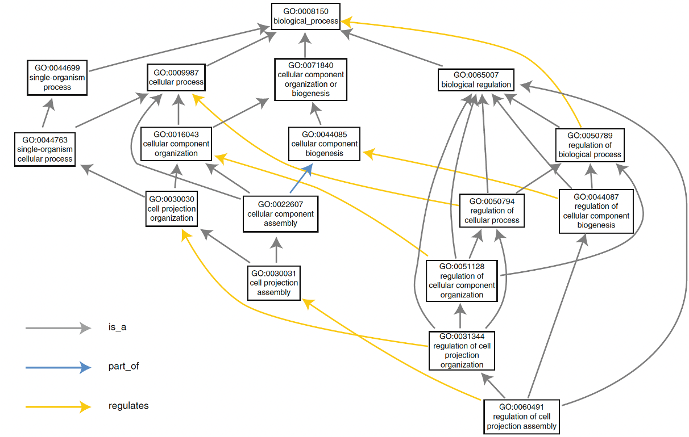
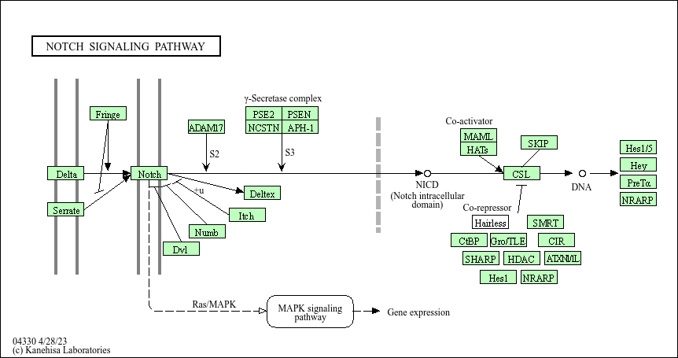

# Recap

## Functional enrichment analysis
Functional enrichment analysis refers to a set of computational approaches designed to derive biological meaning from lists of biomolecules, such as genes, proteins, or metabolites.

By focusing on the biological significance of biomolecular changes, functional enrichment analysis enables researchers to make sense of complex high-throughput data from large-scale studies, revealing the key cellular processes and signaling pathways involved in health and disease states.


### Why Is It Important?
Large-scale omics studies often yield vast datasets with hundreds or thousands of significantly regulated biomolecules. Manually investigating each feature, such as individual genes or proteins, can be overwhelming and inefficient. 

Functional enrichment analysis provides a solution by organising these biomolecules into meaningful categories, allowing for the identification of overarching biological patterns and mechanisms. This helps reduce data complexity and uncovers higher-level biological insights, such as discovering critical pathways involved in disease progression or identifying potential therapeutic targets. Thus, enrichment analysis is a crucial step in the interpretation of high-dimensional omics data, transforming lists of molecular entities into actionable biological knowledge.

### When to Use Functional Enrichment Analysis?
Functional enrichment analysis is typically applied after conducting a differential expression analysis or other comparative analyses in omics studies. This step is essential when attempting to derive biological insights from large lists of biomolecules that exhibit significant changes in expression, modification, or abundance between experimental groups. Below are common scenarios where functional enrichment analysis is particularly valuable:

- Transcriptomics (high-fat diet vs. low-fat diet)
- Proteomics (tumor tissue vs. healthy tissue)
- Lipidomics (disease vs. healthy state)
- Epigenomics (DNA methylation)
- ...

### What Are the Input Data?
Functional enrichment analysis relies on carefully prepared input data derived from an -omics study. The data inputs typically consist of the following components depending on the type of the enrichment analysis:

- <span style="color: orange;">List of Features:</span> This refers to the subset of biomolecules identified as significantly regulated or altered in the study. Features might include genes, proteins, lipids, or other biomolecules, depending on the type of -omics data.

- <span style="color: orange;">Background Set:</span> The background set, or universe, consists of all the features that were measured in the study or a defined subset of the total genome, proteome, or metabolome being studied. The background is critical for enrichment analysis because it provides the context against which the significance of feature enrichment is assessed.

- <span style="color: orange;">Ranked List:</span> In some enrichment methods, such as Gene Set Enrichment Analysis (GSEA), a ranked list is used instead of a simple feature list. The ranking is typically based on a continuous metric such as the magnitude of gene expression changes or some sort of statistical test output. This ranked list helps prioritise features that exhibit the strongest biological relevance and facilitates more nuanced enrichment analyses that consider the direction and strength of biomolecular changes.

### Synonyms
It's important to note that the term "functional enrichment analysis" is often used in different ways across the field. The diversity in terminology can sometimes cause confusion, as the same concept is referred to by various synonymous terms. These include:

- Enrichment analysis
- Pathway analysis
- Pathway enrichment analysis
- Functional annotation analysis
- Annotation enrichment analysis
- Functional pathway analysis
- Functional enrichment analysis
- ...

## Concepts
- <span style="color: orange;">Gene List:</span>
A gene list is the collection of genes (or proteins) that are of particular interest in a biological experiment. This list typically arises from high-throughput experiments such as transcriptomics, proteomics, or genomics, where genes are differentially expressed, mutated, or otherwise identified as significant. In functional enrichment analysis, the gene list is used to assess whether certain biological pathways, gene ontologies, or functions are statistically overrepresented compared to a reference or background set.

- <span style="color: orange;">Background Set:</span>
The background set, also referred to as the "reference set," is the complete set of genes or proteins against which the gene list is compared. This background typically includes all genes that were analysed in the experiment (e.g., all genes in a microarray or RNA-seq dataset). The choice of background is crucial because it influences the statistical significance of the enrichment. For instance, using a background that includes only expressed genes will result in a different outcome compared to using all known genes in the genome.

- <span style="color: orange;">P-value:</span>
The p-value is a measure of the probability that the observed result occurred by chance. At the feature level, it indicates whether a particular gene or protein shows significant differences (e.g., in expression or mutation) when compared to a control or baseline. For example, a p-value of 0.01 for a gene means there’s only a 1% chance that the observed change in that gene is due to random variation. At the enrichment level, the p-value evaluates whether the overlap between the identified genes and a particular biological term (such as a pathway) occurred by chance. A pathway with a p-value of 0.001, for instance, suggests that there’s only a 0.1% probability that the pathway’s association with the gene list occurred randomly.

- <span style="color: orange;">False Discovery Rate (FDR):</span>
The FDR corrects for multiple comparisons, as many tests are conducted both at the feature and enrichment levels. When analysing thousands of genes and numerous pathways, the likelihood of false positives increases, so FDR adjusts for this by controlling the proportion of false positives among the significant results. For example, an FDR threshold of 0.05 means that no more than 5% of the features (e.g., genes) or enriched terms (e.g., pathways) identified as significant are expected to be false positives.

- <span style="color: orange;">Regulation:</span>
In the context of enrichment analysis, regulation refers to the upregulation or downregulation of genes. Many enrichment tools allow users to analyse gene lists with regulation status included. This means pathways or biological functions may be enriched with genes that are specifically upregulated (increased activity) or downregulated (decreased activity). This additional layer of information helps in understanding whether certain pathways or processes are being activated or suppressed in the condition of interest.

- <span style="color: orange;">ID Mapping:</span>
ID mapping refers to the process of converting different types of gene or protein identifiers into a unified format. This is necessary because different databases and platforms may use different types of identifiers (e.g., gene symbols, Entrez IDs, Ensembl IDs, Uniprot IDs). Accurate ID mapping ensures that the gene list aligns with the annotation database being used in the analysis. Tools and databases often provide built-in options for ID conversion to facilitate this step.

- <span style="color: orange;">Annotation Databases:</span>
An annotation database is a curated collection of biological data that links genes or proteins to functional information such as pathways, molecular functions, cellular components, and biological processes. Examples include Gene Ontology (GO), KEGG, Reactome, and MSigDB. These databases provide the functional terms or pathways that are tested for enrichment. The choice of annotation database can significantly influence the results, as different databases may focus on different types of biological information or contain slightly different gene-function relationships.

## Types of Enrichment Analysis

Khatri et al. (2012) nicely explained different types of enrichment analysis, as shown below.

```{r, out.width='100%', fig.align='center', fig.cap='Types of  of functional enrichment analysis'}
knitr::include_graphics("images/fea_types.jpg")
```

*Source: Figure adapted from Khatri P, Sirota M, Butte AJ. Ten years of pathway analysis: current approaches and outstanding challenges. PLoS Comput Biol. 2012;8(2):e1002375.*


### Over Representation Analysis (ORA)
Over Representation Analysis (ORA) is one of the simplest and most widely used methods for functional enrichment analysis. ORA aims to determine whether specific biological categories (e.g., pathways, Gene Ontology terms) are statistically overrepresented in a given list of features (like genes or proteins) compared to a background or reference set. This method focuses on counting the number of features from the list that are associated with a specific category and comparing this count to what would be expected by chance.

<span style="color: orange;"><em>How it works</em></span>: ORA uses a predefined feature list (e.g., from differentially expressed genes), calculates the number of features in the list that belong to a certain category (e.g., a pathway), and tests whether this number is significantly higher than expected using statistical tests like the hypergeometric test or Fisher's exact test.

<span style="color: orange;"><em>Strengths</em></span>: Simple and easy to implement. Works well with a predefined list of significant features.

<span style="color: orange;"><em>Limitations</em></span>: ORA does not take into account the full range of feature expression values and can miss subtle changes across a broader set of features. It relies heavily on selecting a predefined cut-off to create the feature list, which can be subjective.

### Gene Set Enrichment Analysis (GSEA)
Gene Set Enrichment Analysis (GSEA) also known as Functional Class Scoring (FCS) is a more sophisticated method that avoids the need to define a strict cut-off for selecting a list of significant features. Instead of using a discrete list of differentially expressed features, GSEA analyses ranked feature expression data. It evaluates whether predefined gene sets (such as pathways or functional categories) are enriched at the top or bottom of the ranked list, capturing subtle but coordinated changes in gene expression.

<span style="color: orange;"><em>How it works</em></span>: GSEA first ranks all genes in the dataset according to their differential expression levels (e.g., from a control to a condition). Then, for each predefined gene set, it calculates an enrichment score (ES) that reflects the concentration of the gene set members at the extremes of the ranked list. Statistical significance is assessed through permutation testing, and the False Discovery Rate (FDR) is used to correct for multiple comparisons.

<span style="color: orange;"><em>Strengths</em></span>: GSEA avoids arbitrary thresholds for feature selection and can detect coordinated changes across sets of genes, even if individual genes within the set do not show significant differential expression.

<span style="color: orange;"><em>Limitations</em></span>: GSEA may miss smaller pathways or functional categories if their features are not highly ranked or uniformly expressed. It is also more computationally intensive than ORA.

### Pathway Topology (PT)-Based Enrichment
Pathway Topology (PT)-based enrichment analysis extends beyond merely counting features and instead incorporates the topological structure of biological pathways. This method evaluates not only which features are part of a pathway but also their position and interactions within the pathway. By considering the connectivity and interaction strength between features, PT-based approaches provide a more biologically meaningful interpretation of pathway activation or suppression.

<span style="color: orange;"><em>How it works</em></span>: PT-based methods take into account the direction and magnitude of feature expression changes, as well as the structure of pathways (e.g., signaling cascades, metabolic pathways). They consider how biomolecule products interact with one another and the specific roles of each gene within the pathway. Topological factors like the number of connections a gene has or its centrality in the pathway are considered when assessing the enrichment.

<span style="color: orange;"><em>Strengths</em></span>: Provides more biologically relevant insights by considering gene-gene interactions and the position of each gene within a pathway. It is particularly useful for complex pathways where the roles of genes differ based on their interactions with others.

<span style="color: orange;"><em>Limitations</em></span>: Requires more detailed pathway annotations and higher computational complexity. Pathway databases may not have complete or accurate topological information for all pathways, limiting the analysis for certain datasets.

## Annotation Databses
Functional annotation databases are curated collections of biological data that systematically categorise and describe the functions, roles, interactions, and pathways of genes, proteins, or other biological molecules, enabling researchers to link experimental data to biological knowledge.

### [GO: Gene Ontology](https://geneontology.org/)
"The goal of the Gene Ontology Consortium is to produce a dynamic, controlled vocabulary that can be applied to all eukaryotes even as knowledge of gene and protein roles in cells is accumulating and changing." (Ashburner et al. 2000)

```{r, out.width='100%', fig.align='center', fig.cap='The structure of gene ontology.'}

```
*Imagen source [The Gene Ontology Handbook](https://link.springer.com/book/10.1007/978-1-4939-3743-1)*

Gene Ontology (GO) is a structured framework used to describe the roles of genes and their products across all living organisms. It provides a controlled vocabulary that allows for consistent descriptions of gene functions, biological processes, and cellular locations, facilitating computational analysis and integration of biological data across different species. GO's structure comprises three main aspects: 

<span style="color: orange;">1. Molecular Function:</span>
In the Gene Ontology (GO), molecular function refers to the specific biochemical activity that a gene product (such as a protein or RNA) performs. This activity typically involves direct physical interactions with other molecular entities, such as catalysis or binding. These functions are described based on their biochemical roles (e.g., enzyme activity) and their contribution as components within larger biological systems. For instance, protein kinase activity involves the phosphorylation of proteins, which is a specific molecular function. In GO, molecular function is concerned with the direct action of gene products, whether in terms of biochemical interactions or roles in larger biological systems.

<span style="color: orange;">2. Biological Process:</span>
Biological processes represent the larger objectives that gene products contribute to in an organism, often described by the outcome or result of a series of molecular events. These processes are broader, coordinated sequences of molecular activities that achieve a biological objective, such as cell division or DNA replication. A biological process in GO can encompass anything from simple enzymatic actions to complex, regulated systems like embryonic development or immune response. GO annotations aim to associate gene products not only with the processes they directly contribute to but also with processes they regulate or enable.

<span style="color: orange;">3. Cellular Component:</span>
This aspect of GO refers to the specific location within a cell where a gene product operates. Cellular components are described relative to structures within the cell, such as the mitochondrion or plasma membrane, and reflect where molecular functions occur as part of broader biological processes. These locations are vital to understanding where molecular activities take place, as cellular compartmentalisation often influences the function and regulation of gene products. Unlike molecular function and biological process, cellular components refer more to cellular anatomy, specifying where gene products perform their roles during biological activities.

In practice, GO terms and annotations allow researchers to describe gene functions in a standardised way, helping in tasks such as gene function prediction, functional profiling, and comparing genes across species. GO's hierarchical organisation of terms provides a rich framework to model the complexity of biological systems and facilitates the computational study of gene functions.

### [KEGG: Kyoto Encyclopedia of Genes and Genomes](https://www.genome.jp/kegg/)
Kyoto Encyclopedia of Genes and Genomes (KEGG) is a curated database that integrates genomic, chemical, and systemic information to represent biological systems and their interactions. It allows users to map molecular data (such as genes, proteins, and small molecules) to biological pathways, enabling a better understanding of how different components interact within an organism.


```{r, out.width='100%', fig.align='center', fig.cap='NOTCH Signaling Pathway by KEGG'}

```

### [Reactome](https://reactome.org/)
Reactome pathway knowledgebase is an open-access, manually curated database that captures molecular details of biological processes such as signal transduction, DNA replication, metabolism, and more, using a consistent data model across different domains of biology. This makes it particularly well-suited for functional enrichment analysis, where understanding the relationships between gene expression data and biological pathways is crucial.

```{r, out.width='100%', fig.align='center', fig.cap='NOTCH Signaling Pathway by Reactome'}
knitr::include_graphics("images/NOTCH_signaling_pathway_reactome.png")
```

### [MSigDB](https://www.gsea-msigdb.org/)
Molecular Signatures Database (MSigDB) is a comprehensive resource for gene set enrichment analysis. It offers a comprehensive collection of gene sets that represent biological processes, molecular pathways, and other biologically relevant information. MSigDB is integrated with the Gene Set Enrichment Analysis (GSEA) tool, which is commonly used to determine if predefined sets of genes show statistically significant differences between two biological states (e.g., diseased vs. healthy samples).

```{r, out.width='100%', fig.align='center', fig.cap='GSEA Workflow'}
knitr::include_graphics("images/GSEA-homegraphic.gif")
```


## Functional Enrichment Analysis in R
