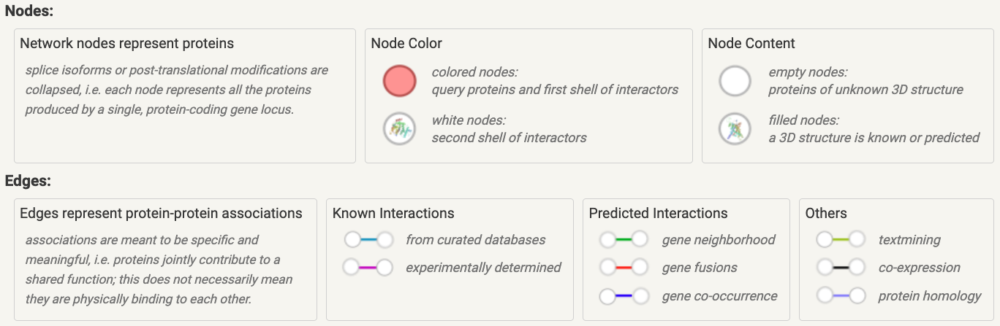
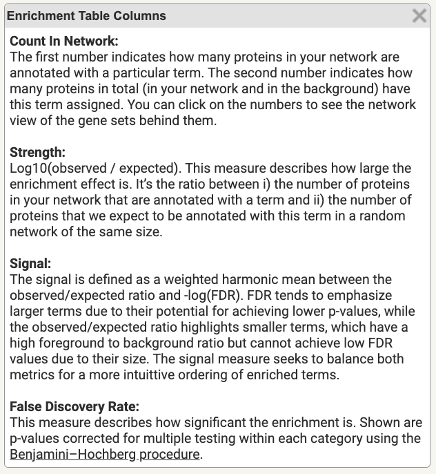
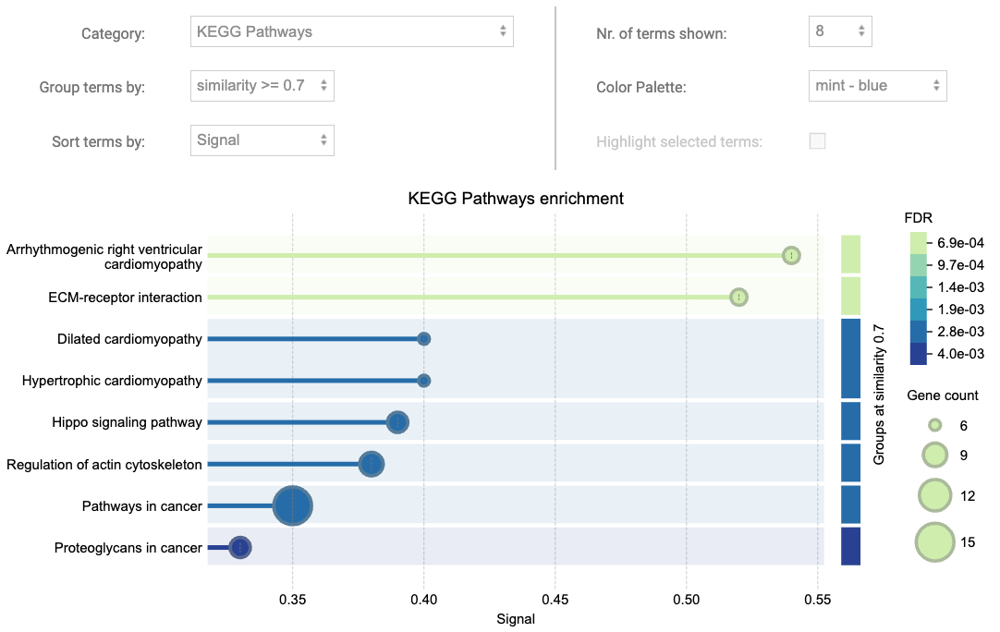
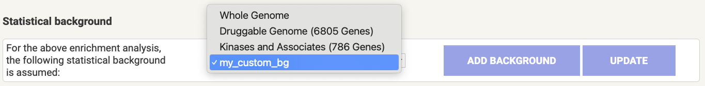
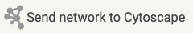
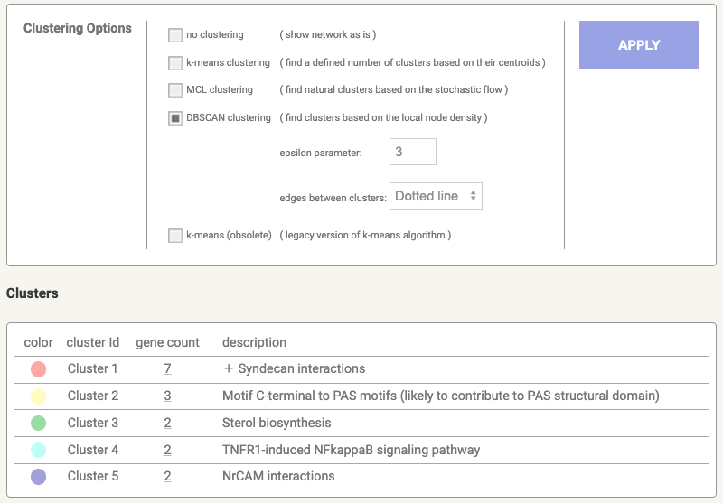
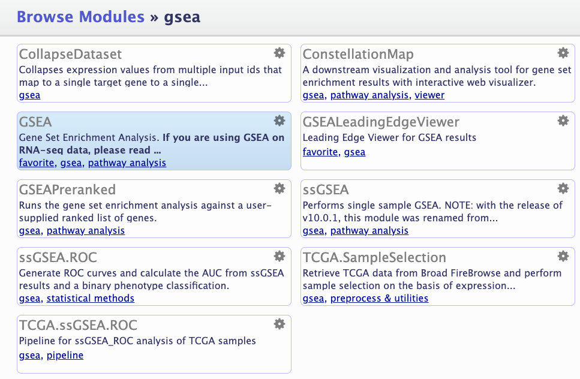

# Online Tools

Functional enrichment analysis can be performed using various web-based tools, each of which is designed to meet specific analytical needs. These tools often vary in the databases they use, their statistical approaches, and their capabilities to perform different types of analysis, such as Over-Representation Analysis (ORA) or Gene Set Enrichment Analysis (GSEA).

In this workshop, we will explore several popular tools for functional enrichment analysis, including gProfiler, STRING, Reactome, and MSigDB GSEA. Each tool offers unique features and insights, providing flexibility in selecting the right method for diverse datasets and research questions.


<!-- ## FEA in [g:Profiler](https://biit.cs.ut.ee/gprofiler/gost) -->
## FEA in gProfiler <a href="https://biit.cs.ut.ee/gprofiler/gost" target="_blank"></a>

gProfiler is known for its integration of numerous species and databases. It supports both ORA and GSEA, enabling users to assess Gene Ontology (GO), biological pathways, regulatory motifs and protein databases. With gProfile one can 

### Steps to perform ORA in g:Profiler:

<span style="color:orange;">- Prepare Input List:</span> Ensure your input is formatted as one gene per line or in a suitable format for g:Profiler.

<span style="color:orange;">- Input Gene List:</span> Paste your prepared gene list directly into the input box on the g:Profiler web page or upload a file containing your list.

<span style="color:orange;">- Select Organism:</span> Choose the appropriate organism from the `Organism` dropdown menu (e.g., *Homo sapiens* for human data).

<span style="color:orange;">- Choose Statistical Domain Scope:</span> Under `Advanced options`, select your preferred statistical background from the `Statistical domain scope` menu.If you choose "Custom" background, provide your custom background list by pasting or uploading the relevant file.

<span style="color:orange;">- Set Significance Threshold:</span> Select the desired significance threshold method, such as *g:SCS*, *Bonferroni*, or *Benjamini-Hochberg*.
   - Specify the threshold value (e.g., 0.05, 0.1, etc.).

<span style="color:orange;">- Select Functional Annotation Databases: </span> Navigate to the `Data sources` tab and choose one or more databases for analysis. Available options include:

  - *Gene Ontology (GO)*: Biological Process, Molecular Function, and Cellular Component.
  - *KEGG Pathways*
  - *Reactome Pathways*
  - *WikiPathways*
  - *TRANSFAC*
  - *mirTarBase*
  - *Human Protein Atlas*
  - *CORUM*
  - *Human Phenotype Ontology (HP)*

<span style="color:orange;">- Run Query:</span> Run the analysis and review the enriched terms, pathways, and visual outputs. Download the results as needed for further exploration.

#### Browse the gProfiler Results

- **Overview**:
  The analysis provided a comprehensive list of enriched terms across selected databases, highlighting significant GO. The results give a high-level summary of pathways or terms most relevant to the input data.

- **Detailed Results**:
  The detailed results section includes a tabulated format with enriched terms, adjusted p-values, and relevant statistics. Each entry provides information such as the enrichment score, associated genes, and functional annotations, allowing for an in-depth understanding of biological significance.

- **GO Context**:
  The Gene Ontology (GO) context is divided into three main categories: Biological Process (BP), Molecular Function (MF), and Cellular Component (CC). The analysis identifies which GO terms are significantly enriched, offering insights into the broader biological implications of the gene set. This helps in pinpointing processes such as cellular responses, metabolic pathways, and molecular interactions.

- **Query Info**:
  This section includes specifics about the input data, including the total number of queried genes and any identifiers not recognized or mapped. It also details the statistical background used, the chosen organism, and other analysis settings, ensuring transparency and reproducibility of the results.


####  {-}

#### Different Backgrounds

#### **Challenge:** How different backgrounds impact the output? {- .challenge}

Use 'All known genes' in one analysis and 'Custom' background in another. Download the results by clicking on CSV button. Browse the results in the spreadsheets and find out the difference between two.

#### **Questions ** {- .rationale}

Which background would you use in your analysis?

How is multi-query support implemented in gProfiler?

How can one perform Under Representation Analysis in gProfiler?

### Steps to perform GSEA in g:Profiler:
<span style="color:orange;">- Prepare Your Pre-ranked List:</span> Steps to provide a ranked gene list are given [here](degust.html).

<span style="color:orange;">- Input Gene List:</span> Paste your prepared gene list directly into the input box on the g:Profiler web page or upload a file containing your list.

<span style="color:orange;">- Select Organism:</span> Same as above.

<span style="color:orange;">- Select Ordered query:</span> The "Ordered query" option in g:Profiler is designed to work with pre-ranked gene lists.

<span style="color:orange;">- Set Significance Threshold:</span> Same as above.

<span style="color:orange;">- Provide a Custom GMT:</span> This GMT file can be downloaded from [MSigDB](https://www.gsea-msigdb.org/gsea/msigdb/index.jsp).

<span style="color:orange;">- Run Query:</span> Same as above.

#### **Challenge:** GSEA with gProfiler {- .challenge}
Download the Hallmark gene sets ([h.all.v2024.1.Hs.symbols.gmt](https://www.gsea-msigdb.org/gsea/msigdb/download_file.jsp?filePath=/msigdb/release/2024.1.Hs/h.all.v2024.1.Hs.symbols.gmt)) from MSigDB and use it as Custom GMT.

#### **Question ** {- .rationale}

How can one use multi-GMT as custom background?

<!-- ## [STRING](https://string-db.org) -->
## FEA in STRING <a href="https://string-db.org" target="_blank"></a>

STRING (Search Tool for the Retrieval of Interacting Genes/Proteins) is a resource for exploring protein-protein interaction (PPI) networks. It combines experimental data, predictions, and curated information to build networks that highlight functional relationships, helping to reveal shared pathways or biological processes within gene or protein lists.

### Steps to Perform ORA in STRING:

<span style="color:orange;">- Select Multiple proteins tab.</span>

<span style="color:orange;">- Input Gene List:</span> Paste your prepared gene list directly into the input box on the STRING web page or upload a file containing your list.

<span style="color:orange;">- Select Organism:</span> Choose the appropriate organism from the `Organisms` dropdown menu (e.g., *Homo sapiens* for human data). STRING would auto-detect the organism if ENSEMBL IDs provided.

<span style="color:orange;">- Modify Settings:</span> Under `Advanced Settings`, you can modify `Required score` from low (0.15) to highest (0.9) confidence. Similarly `FDR stringency` and `Network type` can be selected. 

NOTE: In cases where long list of features is provided, STRING may chnage some of its settings so that:

 - the nodes will have a simplified (not 3D) design
 - previews of protein structures are not shown
 - the network edges show interaction confidence only

### Browse the STRING Results

STRING generates multiple tabs as output, shown here:

<!-- { width=100% } -->
```{r, echo=FALSE, eval=TRUE, out.width="100%", fig.align = "center", fig.cap="Results tabs in STRING"} 
#  out.width="50%",
knitr::include_graphics("images/string-results-tabs.png")
```

#### Viewers

Under the `Viewers` tab, various visualisation layouts are available, with the Network option being the most notable and widely used.

#### Legend

The `Legend` tab offers a guide to the colors of nodes and edges, along with annotations for each individual query in the input list.

<!-- { width=100% } -->
```{r, echo=FALSE, out.width="100%", fig.align = "center", fig.cap="Nodes and edges colour-coded"} 
#  out.width="50%",

```

#### Settings

In the `Settings` tab of the STRING results, users have the flexibility to adjust existing settings and apply new filters to customise their data view and analysis. This tab you to switch between network types, strengths, data sources, intertaction scores and more.

#### Analysis

One of the most essential tabs is the `Analysis` tab, which offers comprehensive functional enrichment analysis from a range of databases. These include Gene Ontology (GO) for biological processes, molecular functions, and cellular components; Pathway enrichment from sources such as KEGG, Reactome, and WikiPathways; and other significant data sources such as Human Phenotype annotations and UniProt for protein function and structure.

Columns of the STRING enrichment table are explained as following:

<!-- { width=40% } -->
<span style="color:orange;">- Count In Network:</span>
The first number indicates how many proteins in your network are annotated with a particular term. The second number indicates how many proteins in total (in your network and in the background) have this term assigned. You can click on the numbers to see the network view of the gene sets behind them.

<span style="color:orange;">- Strength:</span>
Log10(observed / expected). This measure describes how large the enrichment effect is. It’s the ratio between i) the number of proteins in your network that are annotated with a term and ii) the number of proteins that we expect to be annotated with this term in a random network of the same size.

<span style="color:orange;">- Signal:</span>
The signal is defined as a weighted harmonic mean between the observed/expected ratio and -log(FDR). FDR tends to emphasize larger terms due to their potential for achieving lower p-values, while the observed/expected ratio highlights smaller terms, which have a high foreground to background ratio but cannot achieve low FDR values due to their size. The signal measure seeks to balance both metrics for a more intuittive ordering of enriched terms.

<span style="color:orange;">- False Discovery Rate:</span>
This measure describes how significant the enrichment is. Shown are p-values corrected for multiple testing within each category using the Benjamini–Hochberg procedure.

STRING visualises terms within each category using a bubble plot, effectively showcasing the significance and size of enriched terms. Additionally, it renders groups of related terms based on a user-defined similarity level, allowing users to identify clusters of functionally related terms within the data. This helps in interpreting complex enrichment results and highlighting key biological processes or pathways that are closely associated.

<!-- { width=100% } -->
```{r, echo=FALSE, out.width="100%", fig.align = "center", fig.cap="Functional enrichment visualisation with STRING"} 
#  out.width="50%",

```

Towards the the bottom of the `Analysis` page, one can change the background including adding one of their own.
<!-- { width=100% } -->
```{r, echo=FALSE, out.width="100%", fig.align = "center", fig.cap="Statistical background"} 
#  out.width="50%",

```

Finally the enriched terms can be downloaded at the end of the `Analysis` page, either individually per category or all enriched terms together.

#### Exports

The network data can be exported with the `Exports` tab. Also Network data can be directly sent to [Cytoscape](https://cytoscape.org/)  for further networking. It is expected to have Cytoscape installed before exporting to it.

#### Clusters

The `Clusters` tab essentially provides three different types of clustering algorithms:

 - k-means clustering: Initialise *k* centroids randomly, assigns each data point to the nearest centroid, recompute the centroids as the mean of all points in a cluster until until centroids do not change significantly.
 
 - MCL clustering (Markov clustering): is a graph-based algorithm that uses flow simulation to detect clusters in a network by modeling random walks.
 
 - DBSCAN clustering: is a density-based algorithm that groups points closely packed together while marking points in low-density regions as outliers or noise

<!--  -->
```{r, echo=FALSE, out.width="100%", fig.align = "center", fig.cap="Network clustering in STRING"} 
#  out.width="50%",

```

Clusters can be downloaded in `.tsv` format.

#### **Question** {- .rationale}
What was the overlap in enrichment terms between gProfiler and STRING at FDR ≤ 0.05?

<!-- ## FEA in [GenePattern](https://www.genepattern.org/#gsc.tab=0) -->
## FEA in GenePattern <a href="https://www.genepattern.org/#gsc.tab=0" target="_blank"></a>
GenePattern, an online platform developed by the Broad Institute, offers a suite of tools for analyzing and visualizing genomic data, making bioinformatics accessible to researchers through a user-friendly, no-programming interface. Among its supported tools is Gene Set Enrichment Analysis (GSEA), which implements [MSigDB GSEA](https://www.gsea-msigdb.org/gsea/index.jsp) analysis for identifying enriched gene sets in genomic data. 

MSigDB (Molecular Signatures Database) is a collection of gene sets for Gene Set Enrichment Analysis, representing pathways and gene signatures linked to biological states or diseases. It helps identify enriched gene sets, aiding the analysis of gene expression changes and key pathways in experimental data.

### Steps to Locate GSEA Module in GenePattern:

- Click on the Run button and then the Public Server

<!--  -->
```{r, echo=FALSE, fig.align = "center", fig.cap="Navigate to Public Server"} 
#  out.width="50%",
knitr::include_graphics("images/GenePattern-Run.png")
```


- Sign in to GenePattern or Enter as Guest

- Under `Modules` tab hit `Browse Modules`

- Find gsea in the Browse Modules by Category page and hit GSEA

<!-- { width=100% } -->
```{r, echo=FALSE, out.width="100%", fig.align = "center", fig.cap="Browse GSEA module in GenePattern"} 
#  out.width="50%",

```


### Steps to Perform GSEA:
<!-- https://cloud.genepattern.org/gp/pages/index.jsf?jobid=613752&openVisualizers=true&openNewWindow=false -->

1. Basic Parameters

\- Create both `.gct` and `.cls` files following [this scrit in R](degust.html)

\- Load the `.gct` input file in the `expression dataset` tab and `.cls` file in the `phenotype labels` tab

\- Select a `.gmt` file (Gene Matrix Transposed) from the `gene sets database` tab

\- Set permutation under `number of permutations` tab

\- Type of the permuattaion to be set under `permutation type` tab

\- Select an appropriate DNA Chip annotation file from `chip platform file` tab

\- Name the output file in `output file name` tab

2. Advanced Parameters

\- Scoring Scheme:

  - K-S: The score increment is the same for all genes in *S* regardless of their ranking or correlation strength.
 
  - WEighted: the score increment for each gene in *S* is weighted by its correlation with the phenotype, typically the absolute value of the correlation or ranking metric.

\- Metric for ranking genes: Ranking metric of interest can be chosen from drop down menu. A detailed description od the metrics is given on [GSEA-MSigDB Documentation](https://docs.gsea-msigdb.org/#GSEA/GSEA_User_Guide/#metrics-for-ranking-genes).

  - Categorical Phenotypes: Signal-to-Noise Ratio, t-Test, Ratio of Classes, Log2 Ratio of Classes
  
  - Continuous Phenotypes: Pearson Correlation, Spearman Correlation

\- Minimum and Maximum size of gene sets can be set using `max gene set size` and `min gene set size` tabs
<!-- <GeneSetName> <Description> <Gene1> <Gene2> <Gene3> ... -->

#### Browse the GSEA results

Once the job has been queued and successfully run, the output will be listd on the left panel under `Jobs` tab:

```{r, echo=FALSE, fig.align = "center", fig.cap="Job status in GenePattern"} 
#  out.width="50%",
knitr::include_graphics("images/GenePattern-Jobs.png")
```

Of the most important files is the `.zip` file that was earlier specified under `output file name` tab in Basic parameters section which includes all the results. The results can also be navigated using the single files listed under the job id.

For Pezzini experiment, two `html` files generated for each of up- and down-regulated gene sets, something like:

  - gsea_report_for_Diff_1731388275794.html
  
  - gsea_report_for_Nodiff_1731388275794.html

The tabulated versions of the results are given in `.tsv` format:

  - gsea_report_for_Diff_1731388275794.tsv
  
  - gsea_report_for_Nodiff_1731388275794.tsv


<!-- ```{css, echo=FALSE} -->
<!-- table { -->
<!--   width: 75%;                   -->
<!--   margin: auto;                 -->
<!--   border-collapse: collapse;    -->
<!-- } -->

<!-- th, td { -->
<!--   padding: 5px;                 -->
<!--   text-align: left; -->
<!--   border: 1px solid #ddd;       -->
<!-- } -->
<!-- ``` -->

The GSEA result tables have the following header and below is given details of one gene set:

```{r, echo=FALSE, message=FALSE}
data <- data.frame(
  Parameter = c("GS (follow link to MSigDB)", "GS DETAILS", "SIZE", "ES", "NES", "NOM p-val", "FDR q-val", "FWER p-val", "RANK AT MAX", "LEADING EDGE"),
  Value = c(
    "[REACTOME_FRS_MEDIATED_FGFR2_SIGNALING](https://www.gsea-msigdb.org/gsea/msigdb/human/geneset/REACTOME_FRS_MEDIATED_FGFR2_SIGNALING)", 
    "Details ...",  # Link formatted in Markdown
    "16", 
    "0.83905387", 
    "1.7128055", 
    "0", 
    "0.03902518", 
    "0.648", 
    "995", 
    "tags=38%, list=7%, signal=40%"
  )
)

# Display the data as a table
kable(data, caption = "Summary of GSEA Results for REACTOME_FRS_MEDIATED_FGFR2_SIGNALING Gene Set")
```

<!-- HALLMARK_CHOLESTEROL_HOMEOSTASIS -->
<!-- 68	0.59	1.49	0.012	0.059	0.201	4015	tags=60%, list=28%, signal=83% -->

The leading edge column has three values:
  
  - tags: 38% of the genes in the gene set are key to the enrichment result.
  - list: These genes make up 7% of the total gene list being analyzed.
  - signal: They contribute 40% of the enrichment signal, highlighting their importance in driving the association between this gene set and the biological phenotype being studied.


#### **Challenge:** How do different ranking metrics impact the output? {- .challenge}

Run GSEA analysis using Hallmark gene sets with two metrics (tTest and Ratio_of_Classes). What are the upregulated terms (FDR < 0.1) in the `Diff` class, based on the t-test and Ratio of Classes metrics?

#### **Question ** {- .rationale}

Why might the HALLMARK_CHOLESTEROL_HOMEOSTASIS gene set be upregulated specifically in the differentiation condition of SH-SY5Y cells in [Pezzini, et al 2016](https://pubmed.ncbi.nlm.nih.gov/27422411/) experiment?

<details>
<summary>Show</summary>
  - Relevance: Cholesterol is essential for neuronal function and membrane fluidity, particularly in processes like axonal growth and synapse formation. Neurons have a high demand for cholesterol, especially during differentiation when they extend axons and dendrites.
  - Possible Insight: Upregulation of genes in this set could signify that differentiating cells are actively producing or transporting cholesterol to support membrane synthesis and cellular remodeling required for mature neuronal structures.
</details>

####  {-}

<!-- ## FEA in [Reactome](https://reactome.org/) -->
## FEA in Reactome <a href="https://reactome.org/" target="_blank"></a>

Reactome is an open-source database of curated biological pathways across species, offering pathway maps and enrichment tools to analyse gene lists in a pathway-focused context. It’s ideal for visualising data within established biochemical and cellular processes.

Some content with emojis:

- ❓ What do you think about this question?

- 🤔 I'm thinking about how to solve this.


With the Logo:

Option 1


Option 2:

```{r, echo=FALSE, fig.align = "left", fig.cap="RStudio Logo"} 
knitr::include_graphics("images/rstudio_logo.png")
```


