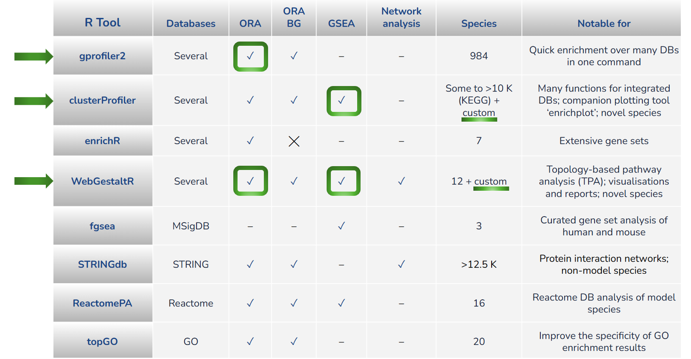

# Introduction

For today's session, we will be using the [R](https://www.r-project.org/) statistical programming language to perform functional enrichmemt analysis using a range of dedicated R packages. To simplify our work, we will be using the [RStudio](https://posit.co/download/rstudio-desktop/) integrated development environment. 

RStudio provides a central place to write code, comments, run code, and view output. We will be using the workshop VMs today which run RStudio and have all the required R packages pre-installed. 

&nbsp;
  <!-- insert blank line -->

## Day 2 overview

1. R environment setup including VM login
2. ORA with `gprofiler2` including multi-query of up and down regulated genes
3. GSEA over KEGG database with `clusterProfiler` and multiple enrichment visualisations with `enrichplot`
4. ORA and GSEA with `WebGestaltR`, interactive HTML reports, and exploration of term redundancy options 
5. Novel species FEA with `clusterProfiler`, `WebGestaltR` and `STRING` (web) 
6. End of workshop summary

&nbsp;
  <!-- insert blank line -->

## R FEA packages for FEA

There are numerous R packages for FEA, each with their strenghts and limitations. It was difficult to restrict the chosen tools in order to fit within the time allocated for the workshop!

&nbsp;
  <!-- insert blank line -->

&nbsp;
  <!-- insert blank line -->

The following three R tools have been selected for today's workshop:  

1. `gprofiler2` due to its ease of use, high number of supported species, and multiple database enrichments produced within a single run. Caveat: only ORA analysis 
2. `clusterProfiler2` due to its integrated database support, runs both GSEA and ORA, companion plotting tool `enrichplot` with diverse plot options, and novel species support 
3. `WebGestaltR` due to its ease of use, high number of suported databases and namespaces, runs both GSEA and ORA, interactive HTML reports and plots, and novel species support 

## Day 2 approach

For this part of the workshop, we will be doing a **semi code-along** approach, where you are not required to type any code (apart from a few basics in the RStudio familiarisation part next up) but we will be running code chunks together, talking about what each part of the code is doing, and viewing the output in real time. 

All of the code required has been prepared into separate code files for each activity, and we will download these to the VMs in the next section. 

