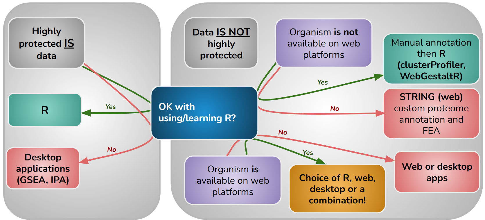

# Making sense of gene and protein lists with functional enrichment analysis: Day 2

## Day 1 recap

- We explored a handful of web-based analysis tools and databases for FEA 
- We explored the impact of gene set size and background list on the ORA statistical test
- We explored the impact of the gene list filtering and the background gene list ('statistical domain scope') on ORA results
- We explored the impact of ranking metric when performing GSEA
- We discussed the impact of database choice on FEA results  

&nbsp;
  <!-- insert blank line -->

## Day 2 overview

In day 2 of this workshop, we will focus on FEA with R-based tools. 

1. R environment setup including VM login
2. ORA with `gprofiler2` including multi-query of up and down regulated genes
3. GSEA over KEGG database with `clusterProfiler` and an exploration of the numerous tool functions and their varying input requirements
4. ORA and GSEA with `WebGestaltR` and a comparison of GO enrichments with and without redundant terms removed 
5. Novel species FEA with `cluterProfiler`, `WebGestaltR` and `STRING` (web) 
6. Discussion of reproducibility in FEA

&nbsp;
  <!-- insert blank line -->

## R FEA tool choice

At a high level, there are 3 fundamental questions to consider when selecting an anaylsis tool:

**1.** Does the governance of your data prohibit you from analysing it on an external server? (ie "highly protected" data) 
**2.** What web or R tools support your species?
**3.** Are you comfortable using R? 

&nbsp;
  <!-- insert blank line -->

&nbsp;
  <!-- insert blank line -->

Beyond that, there are of ocurse biological questions pertaining to to the database used and type of statistical analysis applied. 

&nbsp;
  <!-- insert blank line -->

## R FEA packages for FEA

There are numerous R packages for FEA, each with their strenghts and limitations. It was difficult to restrict the chosen tools in order to fit within the time allocated for the workshop!

&nbsp;
  <!-- insert blank line -->

&nbsp;
  <!-- insert blank line -->

Ultimately, the following tools were chosen in order to provide a collection of code notebooks that could hopefully encompass the needs of most experiments:  

**1.** `gprofiler1` due to its ease of use, high number of supported species, and multiple database enrichments produced within a single run. Caveat: only ORA analysis 
**2.** `clusterProfiler2` due to its integrated database support, runs both GSEA and ORA, companion plotting tool, and novel species support. 
**3.** `WebGestaltR` due to its ease of use, high number of suported databases and namespaces, runs both GSEA and ORA, interactive HTML reports and plots, and novel species support. 

