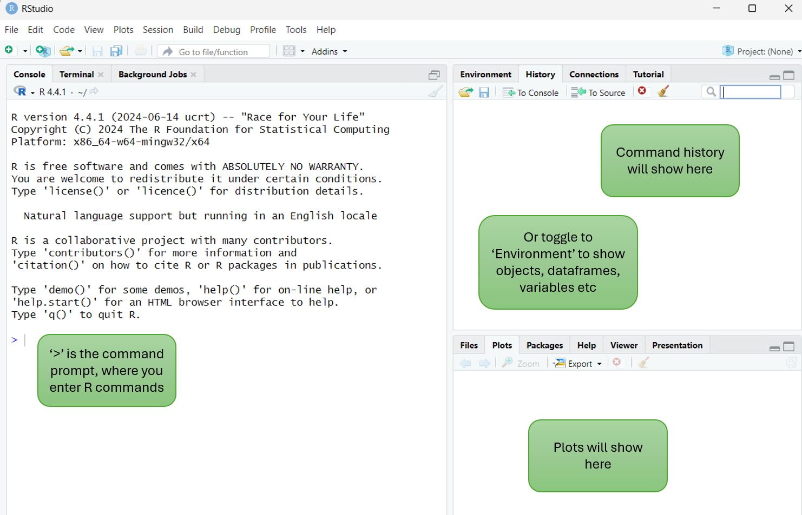
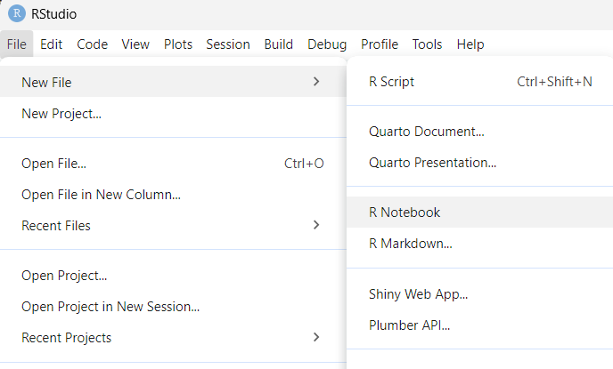

# R environment set up 

For today's session, we will be using the [R](https://www.r-project.org/) statistical programming language to perform functional enrichmemt analysis using a range of dedicated R packages. To simplify our work, we will be using the [RStudio](https://posit.co/download/rstudio-desktop/) integrated development environment. 

This will create a central place to write code, comments, run code, view and save graphics.


<p>&nbsp;</p>  <!-- insert blank line -->

## RStudio basics

RStudio with all the required R packages for today's activities are installed on your VM. 

&#x27A4; Open the RStudio VM using the credentials provided to you.

- **TBA:** - ensure that they have the VM details by now, if not provide further instructions within this section


When RStudio opens, you will see empty `Console`, `History` and `Plots` panes. 



<p>&nbsp;</p>  <!-- insert blank line -->

You can toggle to other panes, for example change `Console` to `Terminal` or change `Plots` to `Files`. 

:file_folder: Since your VM only runs RStudio, you will use the `Files` pane to navigate your workshop folder and view any output files we generate. 

The `Console` contains the command prompt (`>`) which is where R commands are entered.

<p>&nbsp;</p>  <!-- insert blank line -->

&#x27A4; Test this out by copy pasting or typing the below command into your console then pressing `enter` key. This will print the path of your current working directory:

```{r getwd}
getwd()
```

Your path will be something like `/home/user1`.

If you are unfamiliar with R, don't worry because we will provide all the R code that you need to complete today's workshop :smiley: 

<p>&nbsp;</p>  <!-- insert blank line -->

&#x27A4; Click on `Environment` to change the pane to list all active objects in your R session. 

An object refers to things like imported datasets, R dataframes, variables, etc. For a new session, the environment is empty. 

<p>&nbsp;</p>  <!-- insert blank line -->

Let's put something in there:

&#x27A4; Create an R variable called `name` and fill it with your name, then print it with the `cat` command:

```{r my name}
name <- 'Cali'
cat(name)
```

Note that the object `name` is now listed in the environment. 

<p>&nbsp;</p>  <!-- insert blank line -->

Now let's see the `plots` pane in action by creating a simple dummy barplot: 

&#x27A4; Copy paste the below code into your console then press enter:

```{r plot}
values <- c(5, 10, 15)
labels <- c("A", "B", "C")
barplot(values, names.arg = labels)
```

You will now see a barplot in the `plots` pane, as well as 2 new objects in the `environment`. Note that the environment list also tells you what type of objects it is: for our `name` object, the double quotes indicate it's a single string, where `chr [1:3]` for `labels` shows that it is a `character vector` with 3 text elements. `num [1:3]` indicates that `values` is a numeric vector with 3 values. The takeaway message here is that the environment shows your active R objects, and that these are of different types. This is important to be aware of when working in R, because different packages and functions require different input types. During the workshop, we may need to convert our input to a `dataframe` or `vector` for example. 

<p>&nbsp;</p>  <!-- insert blank line -->

## Download input data

- **TBA** - add link to zip file that has the input data and R notebooks for day2. 

<p>&nbsp;</p>  <!-- insert blank line -->

## R notebooks 

Today we will not be entering R commands directly into the console like this. We will instead be using an R notebook. 

Using notebooks in RStudio is a great way to save your code and comments, as well as have the code output display inside the notebook. Notebooks can be easily shared with others so they can run your analysis, and also rendered to HTML which is a neat way of saving and presenting results to others. 

&#x27A4; Open a new R notebook from the RStudio toolbar by selecting `File` &rarr; `New file` &rarr; `R Notebook`:   




The new notebook opens in the `Editor` pane. It has a placeholder title and basic starting instructions. 

<p>&nbsp;</p>  <!-- insert blank line -->

### Code chunks

A code chunk is placed within triple backticks (\```), and the language of the code is included on the first line, in this case `'r'`. Having code in chunks is a way of grouping and running related lines of code together. 

Code chunks can be run by using the green arrow to the right of the chunk or by clicking inside the chunk and entering `ctrl + shift + enter`. There are additional run options under the `Run` menu from the top bar, for example `Run current chunk`, `Run next chunk`, or `Run all chunks below`. 

Code chunks can also be given labels, by placing these inside the curly brackets, leaving a space after the `'r'`. Labels must be unique or rendering to HTML will fail with a message to correct the duplicated labels. 

New code chunks can be added with the shortcut `ctrl + alt + i` or via the toolbar `Code` &rarr; `Insert chunk`.

<p>&nbsp;</p>  <!-- insert blank line -->

&#x27A4; Run the demo code chunk to plot `cars`

Note that the plot dispalys *inside* the notebook, rather than within the plot pane as we saw earlier.

<p>&nbsp;</p>  <!-- insert blank line -->


&#x27A4; Add a new code chunk by entering `ctrl + alt + i` and label it `barplot`. Then copy the dummy barplot code from earlier into the code chunk and run it


```{r barplot}
values <- c(5, 10, 15)
labels <- c("A", "B", "C")
barplot(values, names.arg = labels)
```

<p>&nbsp;</p>  <!-- insert blank line -->

### Rendered HTML notebooks

Next we will look at what a HTML version of the notebook looks like. In order to preview the HTML, we first need to save the notebook. 

&#x27A4;  Change the title to something of your choice and make any other edits you want to, such as deleting some of the default content 

**Note:** don't delete the `output: html_notebook` content from under the title! This will prevent the option to preview the html. 

<p>&nbsp;</p>  <!-- insert blank line -->

&#x27A4; Save the notebook (either `ctrl + s` or `File` &rarr; `Save as`) then preview the HTML by selecting `Preview` from the editor pane toolbar 

`Preview` is for a quick check of how your notebook renders while working on it. For a fullly rendered, static document, use the `knit` function. 

<p>&nbsp;</p>  <!-- insert blank line -->

&#x27A4; Knit the notebook to HTML by selecting  `Knit` &rarr; `Knit to HTML` from the editor pane toolbar 

Note that the HTML is saved to your current working directory, which we previously verified was `/home/userN`. Check that the file appears where you expect it to via the `Files` pane (lower right). 

For today's activities, you have downloaded and unzipped a folder containing the R notebooks required to run the analyses. After each activity, you may choose to knit the notebook to HTML to have a static record of your work :open_book: 

<p>&nbsp;</p>  <!-- insert blank line -->

### A fresh workspace

Next we will open the R notebook for the first analysis activity.  It's ideal to start a new analysis with a clear environment, to avoid unintended object name clashes.


&#x27A4; Clear your environment by selecting `Session` &rarr; `Quit session` &rarr; `Dont save` &rarr;`Start mew session` 

**Note:** when asked `Save workspace image to ~/R.Data?` it is typically advisable to select `Don't Save`. Not saving the workspace image can help avoid workspace clashes that are hard to resolve. You don't need to worry about losing data - after all, your input data is saved elsewhere, and your R code that produces all required outputs is safely saved within the notebook.

Saving the workspace image saves all objects from the session such as your variables and dataframes. This can save time if you need to close an analysis part way through and continue later. However, this can have drawbacks such as the clashes as mentioned, as well as large file size, relic objects cluttering thr workspace, old objects conflicting with new ones, etc. Since we will be performing discrete analysis tasks today, and not continuing on a growing body of work, selecting `Dont save` will be the most appropraite. 

<p>&nbsp;</p>  <!-- insert blank line -->

### Working directory

Now that we have a clear workspace, we will prepare for the first analysis activity by opening the notebook and checking our working directory. 

You have previosuly downloaded an unzipped `Functional_enrichment_workshop_2024`. This contains a folder `day_2`. 

&#x27A4; On the `Files` pane, open the `day_2` folder and confirm that it contains the input data file `Pezzini_DE.txt`

This will be our input file for the first activity. 

<p>&nbsp;</p>  <!-- insert blank line -->

&#x27A4; Load the notebook `Functional_enrichment_workshop_2024/day_2/gprofiler2.Rmd` by selecting `File` &rarr; `Open file`, or use the keyboard shortcut `ctrl + o`. 

The code chunk labelled `working directory` defines the working directory. Setting the working directory is important, as we can then point to the input files we need, and specify output file save locations, relative to this directory. 

- **TBA:** - confirm default path after notebook is loaded

<p>&nbsp;</p>  <!-- insert blank line -->

&#x27A4; Run the working directory code chunk, and confirm that it prints the `day_2` path.

Scroll down to the code chunk labelled `Load input data`. Note that the filepath is simply `Pezzini_DE.txt`. We don't need to specify the full path to our working directory, only the relative path. Since the notebook working directory and input data are both within the same directory, we can simply load the input file by providing the fle name. 

<p>&nbsp;</p>  <!-- insert blank line -->

### R packages

Immediately above the `Load input data` is a code chunk labelled `Load R packages`. This contains all of the R packages required to run the analysis contained within the workbook. Loading all required packages within the notebook, rather than directly via the console, ensures that anyone running your notebook does not encounter errors if they forget to load a required package. 

Note that the packages that are loaded to the session with the R `library` command must first be installed; this has already been been done for you on these VMs. Attempts to load a package that is not installed will meet a fatal error, and installation can then be peformed (not difficult in R) before resuming.

Note that the code chunk label also contains the text `include=FALSE`. This prevents the loading of libraries, which can at times have verbose output, from cluttering up your rendered notebook when it is previewed or knit. 

<p>&nbsp;</p>  <!-- insert blank line -->

&#x27A4; Run the `Load R packages` code chunk. 

Please let us know if you have any errors loading the packages. Don't be alarmed that the output is red! :relaxed: