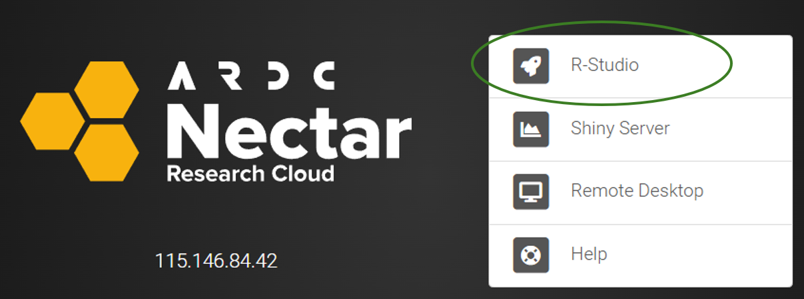
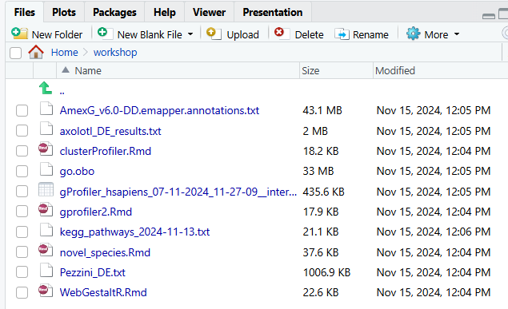

# R environment set up 


## VM login

You have previosuly been provided with an IP address, user name and password for a VM for this workshop. The VM runs RStudio and has all of the required R libraries for today's workshop pre-installed. 


<p>&nbsp;</p>  <!-- insert blank line -->

&#x27A4; Open the VM by copying the IP address into a web browser. 

When prompted, select `RStudio` from the options: 



<p>&nbsp;</p>  <!-- insert blank line -->

Then enter your unique user ID (eg "user1") and password previously provided (and select 'Stay signed in when browser closes' if you wish):


<p>&nbsp;</p>  <!-- insert blank line -->

When RStudio opens, you will see empty `Console`, `History` and `Plots` panes: 


<p>&nbsp;</p>  <!-- insert blank line -->

You can toggle to other panes, for example change `Console` to `Terminal` or change `Plots` to `Files`. 

📁 Since your VM only runs RStudio, you will use the `Files` pane to navigate your workshop folder and view any output files we generate. 

The `Console` contains the command prompt (`>`) which is where R commands are entered.

<p>&nbsp;</p>  <!-- insert blank line -->

&#x27A4; Test this out by copy pasting or typing the below command into your console then pressing the `enter` key. This will print the path of your current working directory:

```{r getwd, echo=TRUE, eval=FALSE}
getwd()
```

Your path will be something like `/home/user1`.

If you are unfamiliar with R, don't worry because we will provide all the R code that you need to complete today's workshop 😃 

<p>&nbsp;</p>  <!-- insert blank line -->

&#x27A4; Click on `Environment` to change the pane to list all active objects in your R session. 

An object refers to things like imported datasets, R dataframes, variables, etc. For a new session, the environment is empty. 

<p>&nbsp;</p>  <!-- insert blank line -->

Let's put something in there:

&#x27A4; Create an R variable called `name` and fill it with your name, then print it with the `cat` command:

```{r my name, echo=TRUE, eval=FALSE}
name <- 'Cali'
cat(name)
```


Note that the object `name` is now listed in the environment. 


<p>&nbsp;</p>  <!-- insert blank line -->


## R notebooks 

Today we will not be entering R commands directly into the console like this. We will instead be using an R notebook. 

Using notebooks in RStudio is a great way to save your code and comments, as well as have the code output display inside the notebook. Notebooks can be easily shared with others so they can run your analysis, and also rendered to HTML which is a neat way of saving a static copy of your work and presenting results to others. 

<p>&nbsp;</p>  <!-- insert blank line -->

&#x27A4; Open a new R notebook from the RStudio toolbar by selecting `File` &rarr; `New file` &rarr; `R Notebook`:   


The new notebook opens in the `Editor` pane. It has a placeholder title and basic starting instructions. 

<p>&nbsp;</p>  <!-- insert blank line -->

### Code chunks

A code chunk is placed within triple backticks (\`\`\`), and the language of the code is included on the first line, in this case `'r'`. Having code in chunks is a way of grouping and running related lines of code together. 

Code chunks can be run by using the green arrow to the right of the chunk or by clicking inside the chunk and entering `ctrl + shift + enter`. There are additional run options under the `Run` menu from the top bar, for example `Run current chunk`, `Run next chunk`, or `Run all chunks below`. 

Code chunks can also be given labels, by placing these inside the curly brackets, leaving a space after the `'r'`. Labels must be unique or rendering to HTML will fail with a message to correct the duplicated labels. 

New code chunks can be added with the shortcut `ctrl + alt + i` or via the toolbar `Code` &rarr; `Insert chunk`.

<p>&nbsp;</p>  <!-- insert blank line -->

&#x27A4; Run the demo code chunk that was included in the new notebook to plot `cars`

Note that the plot dispalys *inside* the notebook, rather than within the plot pane. If this code was executed directly from the `console` rather than the notebook, the plot would be in the `Plots` pane. 


<p>&nbsp;</p>  <!-- insert blank line -->

### Rendered HTML notebooks

Next we will look at what a HTML version of the notebook looks like. In order to preview the HTML, we first need to save the notebook. 

<p>&nbsp;</p>  <!-- insert blank line -->

&#x27A4;  Change the title from the default of `"R Notebook"`to something of your choice, and make any other edits you want to, such as deleting some of the default content 

**Note:** don't delete the `output: html_notebook` content from under the title! This will prevent the option to preview the html. 

<p>&nbsp;</p>  <!-- insert blank line -->

&#x27A4; Save the notebook (either `ctrl + s` or `File` &rarr; `Save as`) then preview the HTML by selecting `Preview` from the editor pane toolbar 

`Preview` is for a quick check of how your notebook renders while working on it. For a fullly rendered, static document, use the `knit` function. 

<p>&nbsp;</p>  <!-- insert blank line -->

&#x27A4; Knit the notebook to HTML by selecting  `Knit` &rarr; `Knit to HTML` from the editor pane toolbar 

Note that the HTML is saved to your current working directory, which we previously verified was `/home/userN`. Check that the file appears where you expect it to via the `Files` pane. 

<p>&nbsp;</p>  <!-- insert blank line -->

### A fresh workspace

Next we will open the R notebook for the first analysis activity.  It's ideal to start a new analysis with a clear environment, to avoid unintended object name clashes.


&#x27A4; Clear your environment by selecting `Session` &rarr; `Quit session` &rarr; `Dont save` &rarr;`Start mew session` 

**Note:** when asked `Save workspace image to ~/R.Data?` please select **`Don't Save`** during this workshop. 

<p>&nbsp;</p>  <!-- insert blank line -->
<details>
<summary>Workspace data: to save or not to save?</summary>

Not saving the workspace image can help avoid workspace clashes that can be hard to resolve or have unintended consequences. You don't need to worry about losing data - after all, your input data is saved elsewhere, and your R code that produces all required outputs is safely saved within the notebook.

Saving the workspace image saves all objects from the session such as your variables and dataframes. This can save time if you need to close an analysis part way through and continue later. However, this can have drawbacks such as library and function name clashes, unexpected objects present in the environment, large objects and relic objects cluttering the workspace, old objects conflicting with new ones, etc. Since we will be performing discrete analysis tasks today, and not continuing on a growing body of work, selecting `Dont save` will be the most appropriate. 

</details>

<p>&nbsp;</p>  <!-- insert blank line -->

👀 You may notice there is also a `Clear Workspace` option under `Session`. This will remove all R objects from your environment, but it won't remove loaded libraries. You can of course unload these with R code, but refreshing the session is easier 😊 Some libraries share function names. If you are being very correct, you can prefix the R package before the function, to ensure the exact function you want is being called to avoid any potential function clashes. I admit to being guilty of not doing that enough! 🤭

<p>&nbsp;</p>  <!-- insert blank line -->

## Download input data

&#x27A4; Copy the below code into your RStudio `console` and press the `enter` key

This will create a new folder called `workshop` and download the required code files and input files for today's activities. 

```{r download data, echo=TRUE, eval=FALSE}
# Create a new directory for the workshop:
dir.create("workshop")

#Download R code notebooks into 'workshop' directory:
download.file("https://monashbioinformaticsplatform.github.io/Functional_Enrichment_BioCommons_2024/day2_Rnotebooks/gprofiler2.Rmd","workshop/gprofiler2.Rmd")

download.file("https://monashbioinformaticsplatform.github.io/Functional_Enrichment_BioCommons_2024/day2_Rnotebooks/gprofiler2.Rmd","workshop/clusterProfiler.Rmd")

download.file("https://monashbioinformaticsplatform.github.io/Functional_Enrichment_BioCommons_2024/day2_Rnotebooks/gprofiler2.Rmd","workshop/WebGestaltR.Rmd")

download.file("https://monashbioinformaticsplatform.github.io/Functional_Enrichment_BioCommons_2024/day2_Rnotebooks/gprofiler2.Rmd","workshop/novel_species.Rmd")

# Download required input data files:

download.file("https://monashbioinformaticsplatform.github.io/Functional_Enrichment_BioCommons_2024/day2_inputData/Pezzini_DE.txt","workshop/Pezzini_DE.txt")

download.file("https://monashbioinformaticsplatform.github.io/Functional_Enrichment_BioCommons_2024/day2_inputData/gProfiler_hsapiens_07-11-2024_11-27-09__intersections.csv","workshop/gProfiler_hsapiens_07-11-2024_11-27-09__intersections.csv")

download.file("https://monashbioinformaticsplatform.github.io/Functional_Enrichment_BioCommons_2024/day2_inputData/AmexG_v6.0-DD.emapper.annotations.txt","workshop/AmexG_v6.0-DD.emapper.annotations.txt")

download.file("https://monashbioinformaticsplatform.github.io/Functional_Enrichment_BioCommons_2024/day2_inputData/axolotl_DE_results.txt","workshop/axolotl_DE_results.txt")

download.file("https://monashbioinformaticsplatform.github.io/Functional_Enrichment_BioCommons_2024/day2_inputData/go.obo","workshop/go.obo")

download.file("https://monashbioinformaticsplatform.github.io/Functional_Enrichment_BioCommons_2024/day2_inputData/kegg_pathways_2024-11-13.txt","workshop/kegg_pathways_2024-11-13.txt")

```

<p>&nbsp;</p>  <!-- insert blank line -->

Your `workshop` folder should now look like this, with a total of 10 files:



<p>&nbsp;</p>  <!-- insert blank line -->

✋ **Please ask for assistance if you have had any issues downloading the input data.**

<p>&nbsp;</p>  <!-- insert blank line -->

### Working directory

Now that we have a clear workspace, we will prepare for the first analysis activity by opening the code notebook and checking our working directory. 

&#x27A4; Load the notebook `gprofiler2.Rmd` notebook by clicking on it in the `Files` pane

You could also open the file by selecting `File` &rarr; `Open file`, or use the keyboard shortcut `ctrl + o`. 

<p>&nbsp;</p>  <!-- insert blank line -->

The default working directory for an R notebook is the directory in which it is saved. 

&#x27A4; Confirm that your working directory is the `workshop` folder by running the code chunk labelled `check notebook workdir` (use the green arrow to the right of the chunk)

Since our code notebooks and input data files are saved within an overly simple directory structure, we won't need to modify the working directory. However in practice, you would typically have different working directories or nested directories, so changing directories and/or providing directory paths when loading or saving files would be required.  

The code chunk labelled `working directory` contains only "hashed out" code and is merely a placeholder for if a directory change is required. 

<p>&nbsp;</p>  <!-- insert blank line -->

Note that the default directory for RStusio (set in the 'Global options') and the default directory for a code notebook differ! You can change the working directory of the console to match the notebook by issuing the below command into your console directly:

```{r plot2, echo=TRUE, eval=FALSE}
setwd("workshop")
``` 

<p>&nbsp;</p>  <!-- insert blank line -->


Scroll down to the code chunk labelled `load input data`. Note that the filepath is simply `Pezzini_DE.txt`. We don't need to specify the full path to our working directory, only the relative path. Since the notebook working directory and input data are both within the same directory, we can simply load the input file by providing the fle name. 

<p>&nbsp;</p>  <!-- insert blank line -->

### R packages

Immediately above the `check notebook workdir` code chunk is a code chunk labelled `Load R packages`. This contains all of the R packages required to run the analysis contained within the workbook. Loading all required packages within the notebook, rather than directly via the console, ensures that anyone running your notebook does not encounter errors if they forget to load a required package. 

Note that the packages that are loaded to the session with the R `library` command must first be installed; this has already been been done for you on these VMs. Attempts to load a package that is not installed will produce an error, and installation can then be peformed (not difficult in R) before resuming.

Note that the code chunk label also contains the text `include=FALSE`. This prevents the loading of libraries (which can at times have verbose output) from cluttering up your rendered notebook when it is previewed or knit. 

<p>&nbsp;</p>  <!-- insert blank line -->

&#x27A4; Run the `Load R packages` code chunk. 

<p>&nbsp;</p>  <!-- insert blank line -->

✋ **Please ask for assistance if you have had any issues loading the R libraries**


Don't be alarmed that the output is <span style="color: red;">red</span>! 🙂