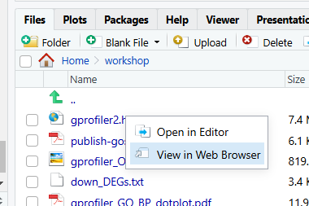

# ORA with gprofiler2

[gprofiler2](https://cran.r-project.org/web/packages/gprofiler2/index.html) is the R interface to the `g:Profiler` web-based toolset that you used in day 1 of the workshop.

Like the web interface, `gprofiler2` performs ORA with `g:GOSt` against multiple databases simultaneously. 

It supports all the same organisms, namespaces and data sources as the web tool. The list of organisms and corresponding data sources is available [here](https://biit.cs.ut.ee/gprofiler/page/organism-list) (n = 984). 

The full list of supported namespaces is available [here](https://biit.cs.ut.ee/gprofiler/page/namespaces-list). 

The `gprofiler2` user guide can be found [here](https://cran.r-project.org/web/packages/gprofiler2/gprofiler2.pdf). 

&nbsp;
  <!-- insert blank line -->

## Input data 

Since we are doing ORA, we will need a filtered gene list, and a background gene list. We will continue with the RNAseq dataset from [Pezzini et al 2017](https://link.springer.com/article/10.1007/s10571-016-0403-y) introduced yesterday. 

&nbsp;
  <!-- insert blank line -->

## Activity overview

1. Load input dataset (a gene matrix with adjusted P values and log2 fold change values) 
2. Filter for differentially expressed genes (DEGs) and create a gene list R object
3. Extract background genes and create a background gene list R object
4. Run ORA with `gost` function
5. Save the tabular results to a file
6. Visualise the results 
7. Run a `gost` multi-query for up-regulated and down-regulated genes
8. Compare `gprofiler2` R results to the `g:Profiler` web results

&nbsp;
  <!-- insert blank line -->

&#x27A4; Go back to your RStudio interface, where we have opened the `gprofiler2.Rmd` notebook and loaded the required R packages. 

**Instructions for the analysis will continue from the notebook.**

&nbsp;
  <!-- insert blank line -->

## End of activity summary

- We have extracted a gene list and background gene list from a DE dataset and run ORA with `gprofiler2` `gost` function
- We have plotted the data with `gostplot` Manhattan plots and `ggplot2` dotplots
- We have run a `gost` multi-query separating up and down regulated genes
- We have verified that `gprofiler2` results match the results from `g:Profiler` web
- We have captured all version details relevant to the session within the R notebook

&nbsp;
  <!-- insert blank line -->

The last task is to `knit` the notebook. Our notebook is editable, and can be changed. Deleting code deletes the output, so we could lose valuable details. If we knit the notebook to HTML, we have a permanent static copy of the work. 

&#x27A4; Knit the notebook to HTML 

On the `editor` pane toolbar, under `Preview`, select `Knit to HTML`.

If you have already run `Preview`, you will see `Knit` instead of `Preview`. 

The HTML file will be saved in the same directory as the notebook, and with the same filename, but the `.Rmd` prefix will be replaced by `.html`. The knit HTML will typically open automatically once complete. If you receive a popup blocker error, click `cancel`, and in the `Files` pane of RStudio, single click the `gprofiler.html` file and select `View in Web Browser`. 

&nbsp;
  <!-- insert blank line -->

Note that the notebook will only successsfully knit if there are no errors in the code. You can 'preview' HTML with code errors. 

✋ **If your knit fails, please ask for assistance resolving the errors**  

