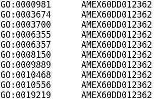
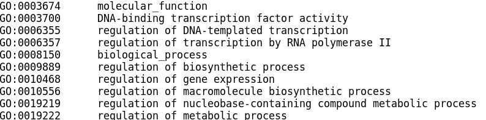
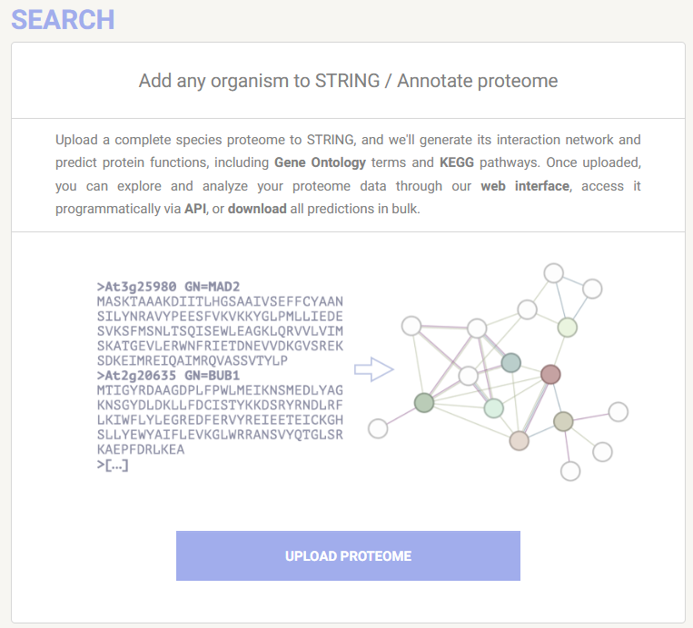
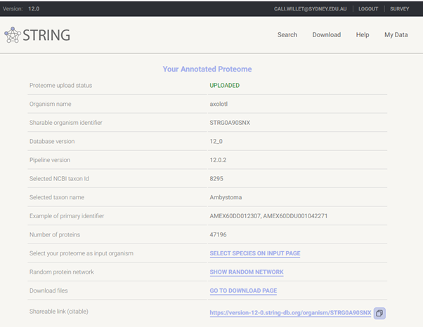

# Novel species functional enrichment analysis

FEA can be easily performed for many non-model species with user friendly web tools or R packages. [g:Profiler](https://biit.cs.ut.ee/gprofiler/gost) web currently supports 984 species, and [STRING](https://string-db.org/) currently supports over 12 thousand species. 

Since many non-model species are supported by some FEA tools, today I am using the term **novel species** to describe a species that is not currently supported by any FEA tool. 

Novel species FEA is possible with `clusterProfiler` or `WebGestaltR` in R, or with `STRING`. The requirements for this are a predicted proteome fasta. If you do not have a predicted proteome for your species, you would need to perform gene prediction, for which there are a number of *in silico* tools available. It must be kept in mind that *in silico* predicted proteomes can vary greatly in quality. Those that include multiple data sources such as polished genome assemblies generated with both short and long read shotgun sequencing and gene prediction that includes RNAseq data are likely to produce better gene predictions than those that are based only on for example short read sequencing. 

**Workflow overview of novel species annotation**

&nbsp;
  <!-- insert blank line -->

In this activity, we will use all three tools to perform FEA on a species that has a publicly available reference genome and gene predictions, but is not currently supported by any web-based FEA tool. 

For `clusterProfiler` and `WebGestaltR`, we will import and reformat an annotation text file to match the requirements of the tools. 

For `STRING`, we will use a STRING annotation on the web tool. 

&nbsp;
  <!-- insert blank line -->

## Axolotl functional enrichment analysis

### Background 

The axolotl (*Ambystoma mexicanum*) is a salamander with some very cool abilities: it can regenerate damaged or amputated tissue, including spinal cord and some brain regions. While this species has reference genome on NCBI, it is not annotated. There is no axolotl Org.db [Bioconductor annotation package](https://bioconductor.org/packages/3.20/data/annotation/) available nor does this species exist in [KEGG Organisms](https://www.genome.jp/kegg/tables/br08606.html). There is however an [axolotl genome browser](https://www.axolotl-omics.org/) where you can download a (slightly less contiguous than the NCBI version) reference genome plus a (non-curated) GTF file.

Despite the lack of quality resources, there is much 'omics work conducted in axolotl due to its regenerative capabilities.

Today we will use [public RNAseq data](https://www.ncbi.nlm.nih.gov/pmc/articles/PMC5419050/#SD7) from axolotl, comparing gene expression in the blastema after proximal (at the shoulder) and distal (at the hand) limb amputation. The blastema is a collection of undifferentiated progenitor cells that give rise to the regenerated limb. Maybe our functional enrichment analysis of differentially expressed genes can help us understand processes that cause the blastema to grow into a full limb or just a hand! 

&nbsp;
  <!-- insert blank line -->

### Raw data sources

- [Reference genome](https://www.axolotl-omics.org/dl/AmexG_v6.0-DD.fa.gz)
- [GTF file](https://www.axolotl-omics.org/dl/AmexT_v47-AmexG_v6.0-DD.gtf.gz)
- [Raw fastq](https://www.ncbi.nlm.nih.gov/bioproject/PRJNA300706)
- [GO 'core' ontology file](https://purl.obolibrary.org/obo/go.obohea)
- [KEGG Pathways file](https://www.pathway.jp/en/academic.html)

&nbsp;
  <!-- insert blank line -->

### Data preparation

#### Annotation files 

The [reference genome](https://www.axolotl-omics.org/dl/AmexG_v6.0-DD.fa.gz) and [GTF gene prediction file](https://www.axolotl-omics.org/dl/AmexT_v47-AmexG_v6.0-DD.gtf.gz) were downloaded from www.axolotl-omics.org. A proteome was created by extracting the predicted peptide seqeunces from the GTF then retaining the longest isoform per gene with `AGAT` v 1.4.0. The predicated proteome was then annotated with `eggNOG emapper` v 2.1.12.

The annotation output file has been provided to you, and we will import this into R and use the `dplyr` package v 1.1.4 to extract GO and KEGG IDs into the required format for R-based FEA with `clsuterProfiler` and `WebGestaltR`.

The predicted proteome was also annotated with [STRING](https://string-db.org/) v 12.0. As of version 12, STRING includes a feature `Add any organism to STRING / Annotate proteome` ([Szklarczyk etl al 2023](https://pmc.ncbi.nlm.nih.gov/articles/PMC9825434/)). The axolotl proteome was uploaded to STRING and annotation performed on STRING servers in less than 1 day. The [resulting annotation](https://version-12-0.string-db.org/organism/STRG0A90SNX) is persistent and shareable and can be used for all of STRING's search functions including ORA (`Multiple proteins`) and GSEA (`Proteins with Values/Ranks`).

&nbsp;
  <!-- insert blank line -->

#### Reads processing and differential expression analysis
Broadly following https://github.com/Sydney-Informatics-Hub/RNASeq-DE, The [raw RNAseq fastq](https://www.ncbi.nlm.nih.gov/bioproject/PRJNA300706) were downloaded from Bioproject, quality trimmed and adapters removed with `BBtools bbduk` v 39.01, then aligned to the reference genome with `STAR` v 2.7.11b. Feature counting was performed with `HTSeq-counts` v 2.0.3 and formatted into a counts matrix. Differential gene expression analysis was performed in R with `DESeq2` v 1.46.0, filtering for genes with at least a count of 10 in at least 2 samples. The data comprises 2 groups (proximal blastema and distal blastema) and 2 replicates per group. 

The DE results file has been provided to you, and we will import this into R to extract our gene lists. 

&nbsp;
  <!-- insert blank line -->

## Activity overview

1. Import `emapper` axolotl annotation file, GO ontology file and KEGG Pathways file
2. Reformat these to create the axolotl database files required by `clusterProfiler` and `WebGestaltR` for GO and KEGG FEA analysis
2. Import axolotl DE results file and extract gene lists for ORA and GSEA
3. Run `clusterProfiler` universal FEA functions `enricher` and `GSEA` using custom database files
4. Visualise `clusterProfiler` results with R plots
5. Run ORA and GSEA with `WebGestaltR` package (function name is also `WebGestaltR`) 
6. Visualise `WebGestaltR` results in the saved output HTML report
7. Run ORA with `STRING` online using custom axolotl annotation
8. Compare `STRING` ORA web results to those generated using the `emapper` annotations in R 

&nbsp;
  <!-- insert blank line -->

## R-based FEA

### clusterProfiler

This tool can perform ORA or GSEA for any organism with the provision of custom `TERM2GENE` and `TERM2NAME` files.  `TERM2GENE` maps the species gene ID to database (eg GO, KEGG) terms, and `TERM2NAME` maps the terms to their descriptive names. The gene IDs for our axolotl annotation are prefixed with `AMEX60DD`.  

**Example TERM2GENE format:** 

&nbsp;
  <!-- insert blank line -->

**Example TERM2NAME format:** 

&nbsp;
  <!-- insert blank line -->

These are then provided to the universal enrichment functions `GSEA` and `enricher` (ORA). It is essential that the gene lists provided have the same gene IDs as those in the `TERM2GENE` file. 

In RStudio, we will extract these file formats from the `emapper` annotations file for axolotl and proceed with FEA. 

Acknowledgement to [Armin Dadras](https://github.com/dadrasarmin) for sharing his [code](https://github.com/dadrasarmin/enrichment_analysis_for_non_model_organism]) to extract `TERM2GENE` and `TERM2NAME` from `emapper` output. 

&nbsp;
  <!-- insert blank line -->

### WebGestaltR

This tool can perform ORA or GSEA for any organism with the provision of custom `GMT` and `description` files. 

The `GMT` file format is slightly different than the typical `gene set matrix transposed file format` you may have seen before. For `WebGestaltR`, the tab-delimited GMT file with `.gmt` suffix has these columns:

1. Gene set ID
2. Web link for gene set
3. Third and sunsequent columns are genes belonging to the gene set

A typical `GMT` file has the gene set description in the second column. For `WebGestaltR`, the tab delimited `description` file with `.des` suffix has these columns:

1. Gene set ID
2. Gene set description

- **TBA:** - webgr file format images 

**Example .gmt format:** 

**Example TERM2NAME format:** 

&nbsp;
  <!-- insert blank line -->

These files are then provided to the single FEA function within the package. The function has the same name as the package - `WebGestaltR`. Users control the analysis type by providing one of `ORA`, `GSEA` or `NTA` arguments to the parameter `enrichMethod`. 

The `.gmt` file is provided to the parameter `enrichDatabaseFile` and the `.des` file is provided to the parameter `enrichDatabaseDescriptionFile`. Specifying `organism = "others"` is also required to run the FEA analysis with the custom databse files. It is essential that the `.gmt` file has the same gene IDs as those in query gene list. 

&nbsp;
  <!-- insert blank line -->

## RNotebook novel species FEA

&#x27A4; Return to RStudio and open the notebook `novel_species.Rmd`.

**We will now continue with the activity in RStudio, before returning here to finish up with STRING web-based analysis.**

&nbsp;
  <!-- insert blank line -->

## STRING novel species FEA

The axolotl putative proteome was previosuly uploaded to STRING and custom annotation performed. This completed using the STRING servers, with compute time less than one day. 

  
  

&nbsp;
  <!-- insert blank line -->

Using the STRING web tool, we will now peform ORA of this custom axolotl annotation. We will not perform GSEA on STRING purely in the interest of time, as the processing takes a lot longer than ORA, however if you wish to run this at a late date, please go ahead! The axolotl annotation link is **persistent** and **citable**, enhancing the reproducibility of your novel species FEA 🏆

&nbsp;
  <!-- insert blank line -->

&#x27A4; Open the following link in your browser: 

https://version-12-0.string-db.org/organism/STRG0A90SNX

`STRG0A90SNX` is the annotation ID assigned by STRING. 

This link will take you to the axolotl annotation page, where you can click `SELECT SPECIES ON INPUT PAGE` to add the custom species to the `Organisms` field, then toggle to your desired search type.

There is also a downloads page, where any of the STRING annotation files can be downloaded. If you wanted to use the STRING annotation files in `clusterProfiler` or `WebGestaltR`, you would download the ['protein enrichment terms'](https://stringdb-downloads.org/download_proteomes/protein.enrichment.terms.v12.0/STRG0A90SNX.protein.enrichment.terms.v12.0.txt.gz) file and then extract the terms and axolotl gene IDs into the required formats, as we did for the `emapper` annotations. 

&nbsp;
  <!-- insert blank line -->

**STRING protein enrichment terms file format:**

&nbsp;
  <!-- insert blank line -->

&#x27A4; On STRING, click `SELECT SPECIES ON INPUT PAGE`, then from the left search options, select `Multiple proteins`.

Note that the `Organism` field is pre-filled with `STRG0A90SNX (axolotl)`. 

&nbsp;
  <!-- insert blank line -->

&#x27A4; In the RStudio `Files` pane, locate your saved ORA gene list from earlier - `axolotl_DEGs.txt`. Click the file to view it in RStudio, then copy paste the list into the STRING `List of Names` search field, then select `SEARCH`. 

Click `CONTINUE` at the gene ID review page, and then explore the results!

Clicking on the `Analysis` tab will show the enichment tables with results for GO, STRING, KEGG, Reactome, TISSUES and UniProt.

Below the tables, under `Functional enrichment visualization` you can change `Category` to alter which databases results are plotted. 

&nbsp;
  <!-- insert blank line -->

### How do the STRING results compare to those we generated in R? 

- **TBA:** - side by side plot comparison for STRING v R one of the ORA (CP GO, CO KEGG, WGR GO, or WGR KEGG)

We expect quite a bit of difference in the results because of the vast difference in annotation method. 

`emapper` appears more stringent than STRING in its similarity matches between the axolotl putative proteins and annotated homologs. The table below compares the number of annotations yielded from the 47,196 putative axolotl proteins from both tools: 

|   Method    | GO      | KEGG Pathways | All     |
|-------|---------|---------------|---------|
| emapper | 21,376 | 12,229        | 39,539  |
| STRING  | 36,895 | 21,502        | 38,398  |

&nbsp;
  <!-- insert blank line -->

This suggests that the `emapper` results may be more specific, while the `STRING` results may be more sensitive. Using both methods for your novel species FEA may help validate and focus your FEA findings 💪    