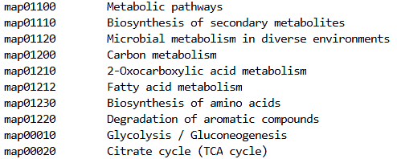
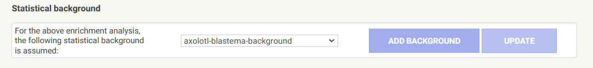
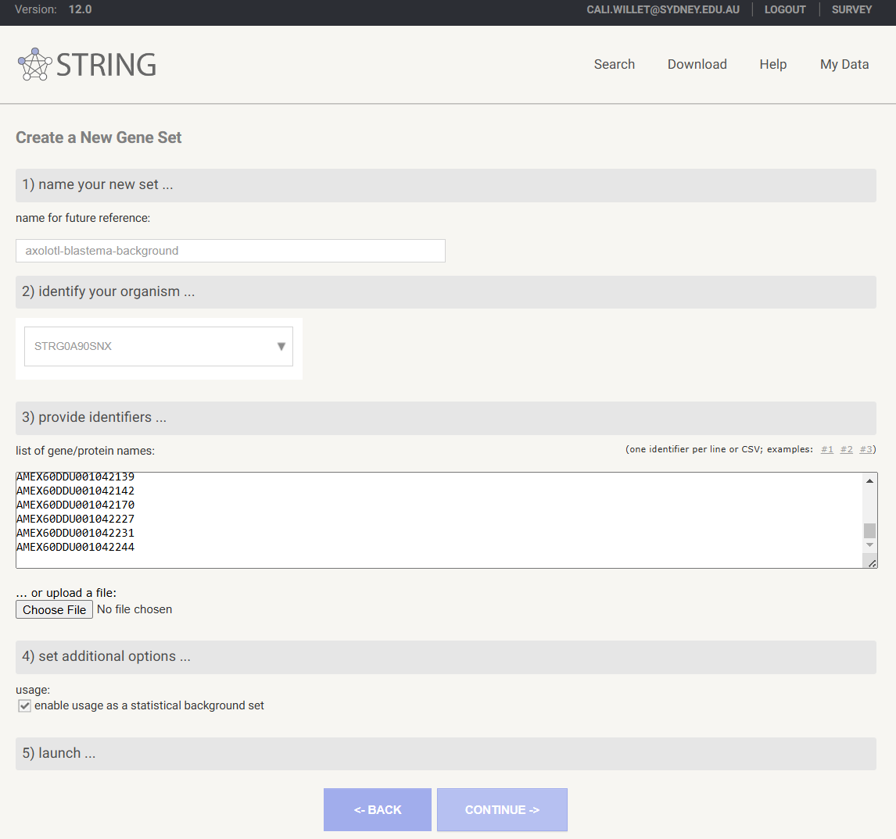
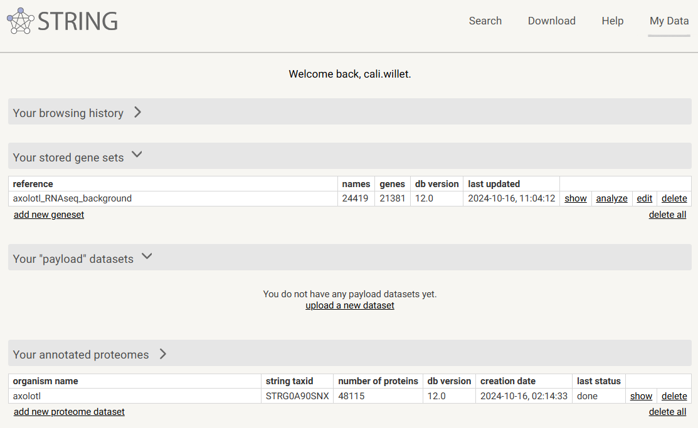
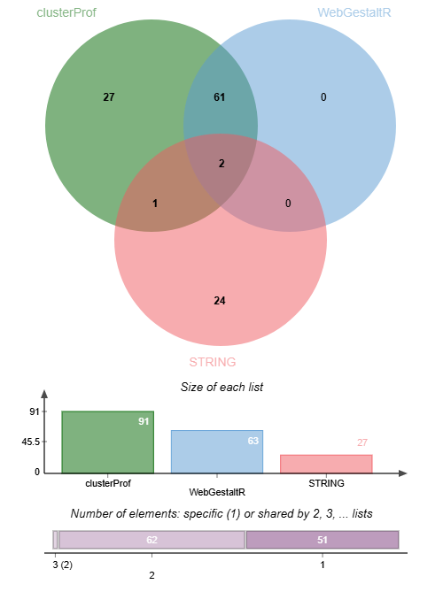

# Novel species FEA

FEA can be easily performed for many non-model species with user friendly web tools or R packages. [g:Profiler](https://biit.cs.ut.ee/gprofiler/gost) web currently supports 984 species, and [STRING](https://string-db.org/) currently supports over 12 thousand species. 

Since many non-model species are supported by some FEA tools, today I am using the term **novel species** to describe a species that is not currently supported by any FEA tool. 

Novel species FEA is possible with `clusterProfiler` or `WebGestaltR` in R, or using web tools `WebGestalt` or `STRING`. The requirements for each tool are slightly different, however at minimum a predicted proteome fasta is necessary. If you do not have a predicted proteome for your species, you would need to perform gene prediction, for which there are a number of *in silico* tools available. It must be kept in mind that *in silico* predicted proteomes can vary greatly in quality. Those that include multiple data sources such as polished genome assemblies generated with both short and long read shotgun sequencing and gene prediction that includes RNAseq data are likely to produce better gene predictions than those that are based only on for example short read sequencing. 

**Workflow overview of novel species annotation**

&nbsp;
  <!-- insert blank line -->

In this activity, we will use all three tools to perform FEA on a species that has a publicly available reference genome and gene predictions, but is not currently supported by any web-based FEA tool. 

For `clusterProfiler` and `WebGestaltR`, we will import and reformat an annotation text file to match the requirements of the tools. 

For `STRING`, we will use a STRING annotation on the web tool. 

&nbsp;
  <!-- insert blank line -->

## Axolotl functional enrichment analysis

### Background 

The axolotl (*Ambystoma mexicanum*) is a salamander with some very cool abilities: it can regenerate damaged or amputated tissue, including spinal cord and some brain regions. While this species has reference genome on NCBI, it is not annotated. There is no axolotl Org.db [Bioconductor annotation package](https://bioconductor.org/packages/3.20/data/annotation/) available nor does this species exist in [KEGG Organisms](https://www.genome.jp/kegg/tables/br08606.html). There is however an [axolotl genome browser](https://www.axolotl-omics.org/) where you can download a (slightly less contiguous than the NCBI version) reference genome plus a (non-curated) GTF file.

Despite the lack of quality resources, there is much 'omics work conducted in axolotl due to its regenerative capabilities.

Today we will use [public RNAseq data](https://www.ncbi.nlm.nih.gov/pmc/articles/PMC5419050/#SD7) from axolotl, comparing gene expression in the blastema after proximal (at the shoulder) and distal (at the hand) limb amputation. The blastema is a collection of undifferentiated progenitor cells that give rise to the regenerated limb. Maybe our functional enrichment analysis of differentially expressed genes can help us understand processes that cause the blastema to grow into a full limb or just a hand! 

## Caveat!

This is not a real experiment! It was tricky to find a novel species that had: 

A) a reference genome
B) a GTF
C) was not natively supported by any FEA tool
D) had publicly available RNAseq data
E) FEA described in a peer-reviewed study 

This axolotl data ticked A through D yet not E (RNA from various tissues were sequenced to aid a genome assembly project rather than for a valid biological experiment). Please keep this in mind when reviewing the results of the FEA we perform 😉 The goal of the session is not *really* to uncover how a blastema differentiates into a hand or an arm, but to demonstrate to you how you can apply this method to your own novel species. 

&nbsp;
  <!-- insert blank line -->

### Raw data sources

- [Reference genome](https://www.axolotl-omics.org/dl/AmexG_v6.0-DD.fa.gz)
- [GTF file](https://www.axolotl-omics.org/dl/AmexT_v47-AmexG_v6.0-DD.gtf.gz)
- [Raw fastq](https://www.ncbi.nlm.nih.gov/bioproject/PRJNA300706)
- [GO 'core' ontology file](https://purl.obolibrary.org/obo/go.obo)
- [KEGG Pathways file](https://www.pathway.jp/en/academic.html)

&nbsp;
  <!-- insert blank line -->

### Data preparation

#### Annotation files 

The [reference genome](https://www.axolotl-omics.org/dl/AmexG_v6.0-DD.fa.gz) and [GTF gene prediction file](https://www.axolotl-omics.org/dl/AmexT_v47-AmexG_v6.0-DD.gtf.gz) were downloaded from www.axolotl-omics.org. A proteome was created by extracting the predicted peptide sequences from the GTF then retaining the longest isoform per gene with `AGAT` v 1.4.0. The predicated proteome was then annotated with `eggNOG emapper` v 2.1.12.

The annotation output file has been provided to you, and we will import this into R and use the `dplyr` package v 1.1.4 to extract GO and KEGG IDs into the required format for R-based FEA with `clsuterProfiler` and `WebGestaltR`.

The predicted proteome was also annotated with [STRING](https://string-db.org/) v 12.0. As of version 12, STRING includes a feature `Add any organism to STRING / Annotate proteome` ([Szklarczyk etl al 2023](https://pmc.ncbi.nlm.nih.gov/articles/PMC9825434/)). The axolotl proteome was uploaded to STRING and annotation performed on STRING servers in less than 1 day. The [resulting annotation](https://version-12-0.string-db.org/organism/STRG0A90SNX) is persistent and shareable and can be used for all of STRING's search functions including ORA (`Multiple proteins`) and GSEA (`Proteins with Values/Ranks`).

&nbsp;
  <!-- insert blank line -->

#### Reads processing and differential expression analysis
Broadly following https://github.com/Sydney-Informatics-Hub/RNASeq-DE, The [raw RNAseq fastq](https://www.ncbi.nlm.nih.gov/bioproject/PRJNA300706) were downloaded from Bioproject, quality trimmed and adapters removed with `BBtools bbduk` v 39.01, then aligned to the reference genome with `STAR` v 2.7.11b. Feature counting was performed with `HTSeq-counts` v 2.0.3 and formatted into a counts matrix. Differential gene expression analysis was performed in R with `DESeq2` v 1.46.0, filtering for genes with at least a count of 10 in at least 2 samples. The data comprises 2 groups (proximal blastema and distal blastema) and 2 replicates per group. 

The DE results file has been provided to you, and we will import this into R to extract our gene lists. 

&nbsp;
  <!-- insert blank line -->

## Activity overview

1. Import `emapper` axolotl annotation file, GO ontology file and KEGG Pathways file
2. Import axolotl DE results file and extract gene lists for ORA and GSEA
3. Reformat annotation files for `clusterProfiler` GO and KEGG analysis
4. Run `clusterProfiler` universal FEA functions `enricher` and `GSEA` and visualise results with `enichPlot`
5. Reformat annotation files for `WebGestaltR` GO and KEGG analysis
6. Run `WebGestaltR` ORA and GSEA and visualise results in the interactive HTML report
7. Run ORA with `STRING` online using custom axolotl annotation
8. Compare `STRING` ORA web results to those generated using the `emapper` annotations in R 

&nbsp;
  <!-- insert blank line -->

Before heading over to RStudio, we will briefly review the annotation requirements for the R tools. At the end of the R-based analysis, we will return here for the web-based analysis with `STRING`.  

&nbsp;
  <!-- insert blank line -->

## R-based FEA

### clusterProfiler

This tool can perform ORA or GSEA for any organism with the provision of custom `TERM2GENE` and `TERM2NAME` files.  `TERM2GENE` maps the species gene ID to database (eg GO, KEGG) terms, and `TERM2NAME` maps the terms to their descriptive names. The gene IDs for our axolotl annotation are prefixed with `AMEX60DD`.  

**Example TERM2GENE format:** 

&nbsp;
  <!-- insert blank line -->

**Example TERM2NAME format:** 

&nbsp;
  <!-- insert blank line -->

These are then provided to the universal enrichment functions `GSEA` and `enricher` (ORA). It is essential that the gene lists provided have the same gene IDs as those in the `TERM2GENE` file. 

In RStudio, we will extract these file formats from the `emapper` annotations file for axolotl and proceed with FEA. 

We are using GO and KEGG today, however you can use any database, provided you first annotate your proteome to the database in order to obtain the term to name mappings. 

Acknowledgement to [Armin Dadras](https://github.com/dadrasarmin) for sharing his [code](https://github.com/dadrasarmin/enrichment_analysis_for_non_model_organism]) to extract `TERM2GENE` and `TERM2NAME` from `emapper` output. 

&nbsp;
  <!-- insert blank line -->

### WebGestaltR

This tool can perform ORA or GSEA for any organism with the provision of custom `GMT` and `description` files. 

The `GMT` file format is slightly different than the typical `gene set matrix transposed file format` you may have seen before, which typically has the gene set description in the second column. For `WebGestaltR`, the description is in a separate file, and the tab-delimited GMT file with `.gmt` suffix has these 3 columns:

1. Gene set ID
2. Web link for gene set
3. Third and subsequent columns are genes belonging to the gene set

**Example .gmt format:** 

&nbsp;
  <!-- insert blank line -->

The `WebGestaltR` tab delimited `description` file with `.des` suffix has these columns:

1. Gene set ID
2. Gene set description

**Example .des format:**

&nbsp;
  <!-- insert blank line -->

These files are then provided to the single FEA function within the package. The function has the same name as the package - `WebGestaltR`. Users control the analysis type by providing one of `ORA`, `GSEA` or `NTA` arguments to the parameter `enrichMethod`. 

The `.gmt` file is provided to the parameter `enrichDatabaseFile` and the `.des` file is provided to the parameter `enrichDatabaseDescriptionFile`. Specifying `organism = "others"` is also required to run the FEA analysis with the custom databse files. It is essential that the `.gmt` file has the same gene IDs as those in query gene list. 

&nbsp;
  <!-- insert blank line -->

### Mapping database terms to descriptions

Annotating a proteome with a tool such as `emapper` provides a connection between your novel species gene IDs and term IDs. To add the term description, we need a database file. In this analysis, we will use the [GO 'core' ontology file](https://purl.obolibrary.org/obo/go.obo) and the [KEGG Pathways file](https://www.pathway.jp/en/academic.html). These files were downloaded to the `workshop` folder of the VMs during our setup session. 

The GO `go.obo` is a text file (>600K lines) with details for all terms in GO at the time of download. The second line of the file contains the GO database version, in this case: `data-version: releases/2024-06-17`. 

**go.obo term information is structured like this:**

The KEGG Pathways file is identical in format to what is required for both the `clusterProfiler` `TERM2NAME` and `WebGestaltR` `.des` files:

**KEGG Patwhays file format:**

&nbsp;
  <!-- insert blank line -->

## RNotebook novel species FEA

&#x27A4; Go back to your RStudio interface and clear your environment by selecting `Session` &rarr; `Quit session` &rarr; `Dont save` &rarr; `Start new session`

&#x27A4; Open the notebook `novel_species.Rmd`.

**We will now continue with the activity in RStudio, before returning here to finish up with STRING web-based analysis.**

&nbsp;
  <!-- insert blank line -->

&nbsp;
  <!-- insert blank line -->

💫 You have  now explored two tools performing FEA in R for your novel species, and we have observed that both methods require the same starting files (annotation of novel species genes to databases, database term IDs to term descriptions) and give very similar results. Which you use depends on your personal preferences. 

- Do you enjoy the flexibility of plot options offered with `clusterProfiler` and `enrichplot`?
- Do you love the ease of use and interactive HTML provided by `WebGestaltR`? 

We will now take a quick look at novel species FEA online with `STRING`. 

&nbsp;
  <!-- insert blank line -->

## STRING (web) novel species FEA

The axolotl putative proteome was previosuly uploaded to STRING and custom annotation performed. This completed using the STRING servers, with compute time less than one day. 

&nbsp;
  <!-- insert blank line -->

&nbsp;
  <!-- insert blank line -->

Using the STRING web tool, we will now peform ORA of this custom axolotl annotation. We will not perform GSEA on STRING purely in the interest of time, as the processing takes a lot longer than ORA, however if you wish to run this at a late date, please go ahead! The axolotl annotation link is **persistent** and **citable**, enhancing the reproducibility of your novel species FEA 🏆

&nbsp;
  <!-- insert blank line -->

&#x27A4; Open the following link in your browser: 

https://version-12-0.string-db.org/organism/STRG0A90SNX

`STRG0A90SNX` is the annotation ID assigned by STRING. 

This link will take you to the axolotl annotation page, where you can click `SELECT SPECIES ON INPUT PAGE` to add the custom species to the `Organisms` field, then toggle to your desired search type.

There is also a downloads page, where any of the STRING annotation files can be downloaded. If you wanted to use the STRING annotation files in `clusterProfiler` or `WebGestaltR`, you would download the ['protein enrichment terms'](https://stringdb-downloads.org/download_proteomes/protein.enrichment.terms.v12.0/STRG0A90SNX.protein.enrichment.terms.v12.0.txt.gz) file and then extract the terms and axolotl gene IDs into the required formats, as we did for the `emapper` annotations. 

&nbsp;
  <!-- insert blank line -->

**STRING protein enrichment terms file format:**

&nbsp;
  <!-- insert blank line -->

&#x27A4; On STRING, click `SELECT SPECIES ON INPUT PAGE`, then from the left search options, select `Multiple proteins`.

Note that the `Organism` field is pre-filled with `STRG0A90SNX (axolotl)`. 

&nbsp;
  <!-- insert blank line -->

&#x27A4; In the RStudio `Files` pane, locate your saved ORA gene list from earlier - `workshop/Axolotl_DEGs.txt`. Click the file to view it in RStudio, then copy paste the list into the STRING `List of Names` search field, then select `SEARCH`

&#x27A4; Click `CONTINUE` at the gene ID review page

Before we explore the results, note that we have performed ORA without a background gene list! 😮

There is no option at the query page (even under `Advanced Settings`) to provide a custom background gene list initially. This must be done *after* the initial search has been run. Hopefully this will change in future versions 🫠 

❗In order to add or apply a previously saved custom background gene list, you need to be logged in to `STRING`. The upload can take a bit of time, so you do not need to do this now, however the dropdowns below provide instructions for applying a saved background or adding a new one. 

Add a saved custom background to STRING analysis

&nbsp;
  <!-- insert blank line -->

1. After running ORA or GSEA, on the results page, click on the `ANALYSIS` tab
2. Scroll ALL the way to the bottom of the page to the subheading `Statistical background`
    - If you do not have a relevant saved background gene list in your `STRING` saved datasets, you would select `Add background`. See next dropdown for details 
    - If you do have a relevant background saved, change `Whole Genome` to the relevant gene background list from the drop-down menu
3. Once you have selected the background, click `UPDATE` and the FEA will be re-computed using the custom statistical background 

&nbsp;
  <!-- insert blank line -->

Save a new custom background gene list to your STRING profile

&nbsp;
  <!-- insert blank line -->

1. Under `ANALYSIS` tab of results page, at `Statistical background`, select `ADD BACKGROUND`
2. You will be prompted to login if you are not already
3. Under `1) name your new set` provide a descriptive name for your background gene list
4. Select your organism at `2) identify your organism` 
5. At `3) provide identifiers` copy your list of background IDs into the `list of gene/protein names` field
6. Ensure that `enable usage as a statistical background` is checked at `4) set additional options...`
7. Click `CONTINUE` to map your IDs. This may take several minutes. 

&nbsp;
  <!-- insert blank line -->

&nbsp;
  <!-- insert blank line -->

`STRING` saves your custom datasets under `My Data`:

&nbsp;
  <!-- insert blank line -->

&nbsp;
  <!-- insert blank line -->

**Now let's explore the results!**

Some suggestions:

- Select a node on the network, and then `Show this node's terms in the analysis table` to highlight the terms the gene was present in 
- Select the coloured lines connecting nodes to show evidence suggesting a functional link (all putative of course!)
- Clicking on the `Analysis` tab will show the enrichment tables with results for GO, STRING, KEGG, Reactome, TISSUES and UniProt
- Below the tables, under `Functional enrichment visualization` you can change `Category` to alter which database results are plotted

&nbsp;
  <!-- insert blank line -->

### How do the STRING results compare to those we generated in R? 

**We expect a large difference in the results because of the differing proteome annotation methods - both the annotation tool and the databases that were annotated against.**  

The `eggNOG emapper` annotations we used in `R` rely on orthology-based predictions, employing extensive similarity searches to map genes to their closest evolutionary counterparts across diverse species. This results in a more comprehensive catalog of functional terms, even if they are inferred rather than directly evidenced.

In contrast, `STRING’s` custom species annotations are based on high-confidence protein-protein interaction networks and empirical data, which can narrow down the set of enriched pathways. We expect species bias to have a considerable effect when attempting to use this platform for novel species. 

First of all we see a difference in the number of genes annotated to terms: 

|   Method    | GO      | KEGG Pathways | All     |
|-------|---------|---------------|---------|
| emapper | 21,376 | 12,229        | 39,539  |
| STRING  | 36,895 | 21,502        | 38,398  |

&nbsp;
  <!-- insert blank line -->

And a clear lack of overlap in number of enriched GO terms and term IDs between `STRING` and the `R` tools:

These GO terms from `STRING` may be parent terms of more specific child terms prevalent in the `R` output. For a real world analysis, it would be optimal to compare, and deduce whether both methods could provide valuable and complimentary insights, or whether the results from one annotation approach or the other were more suited to your novel species. 

Whichever you choose, strength to you! This is not an easy space to work in 💪 

Remember the importance of validating your results through other means! 🧪