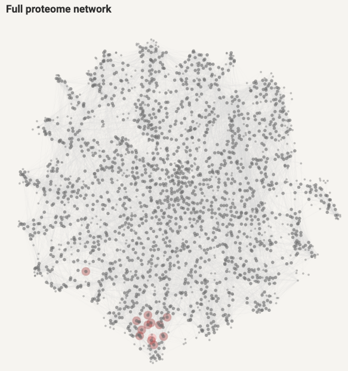
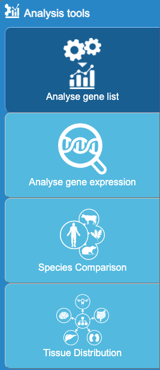
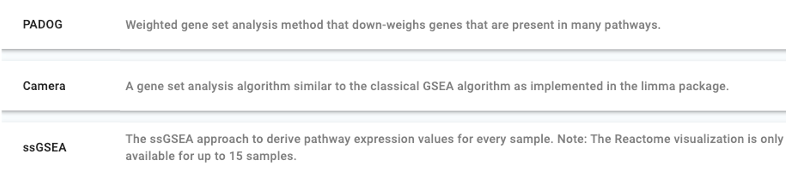
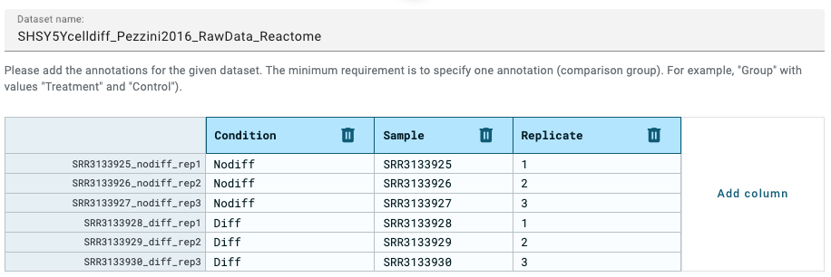
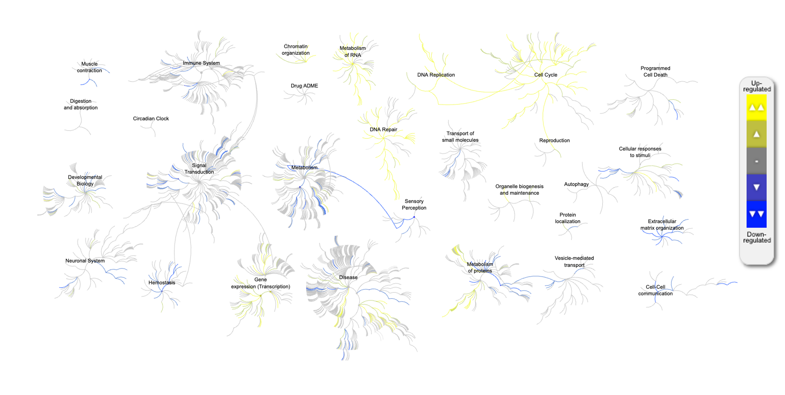
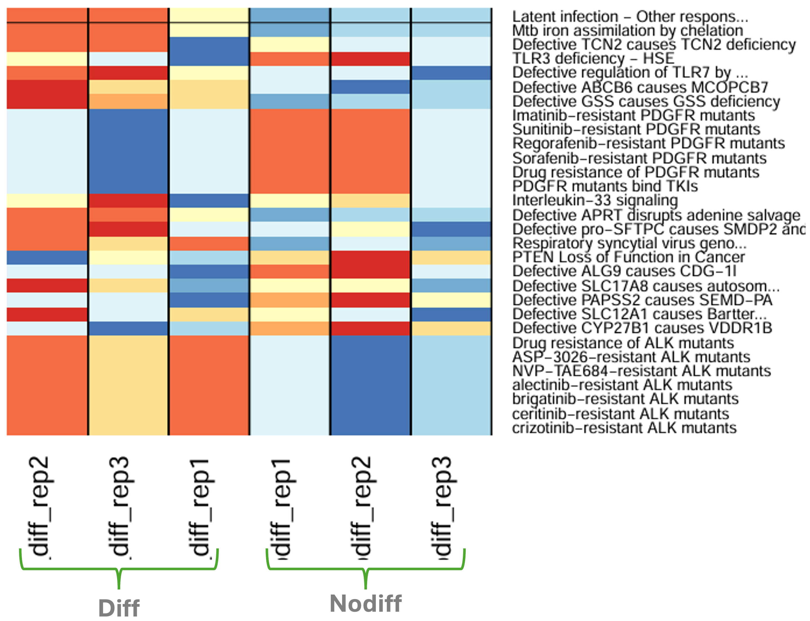
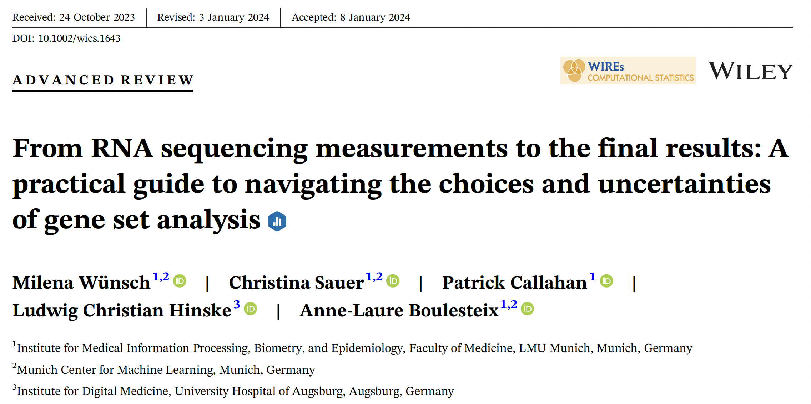
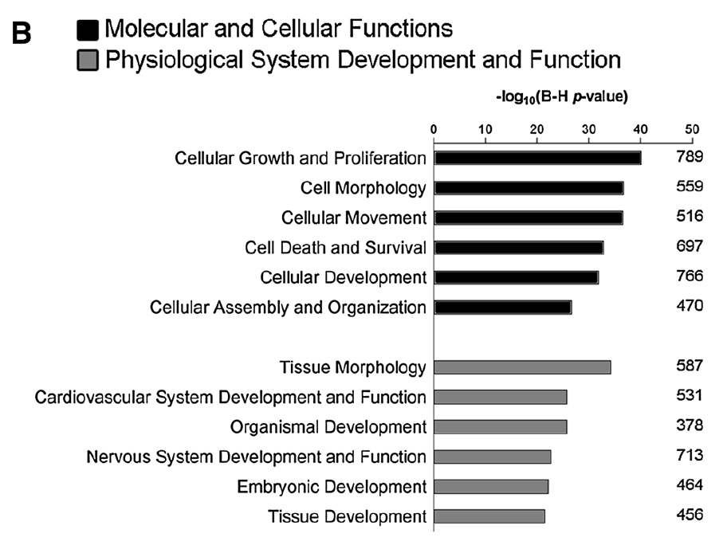

```{r include=FALSE, cache=FALSE}
# example R options set globally
options(width = 100)

# example chunk options set globally
knitr::opts_chunk$set(
  comment = "#>",
  collapse = TRUE,
  echo=FALSE
)


# This reads the list of files/directories under
# copy_resources: in _bookdown.yml and copies them
# to the output document folder.
library(yaml)
library(fs)

yaml_path <- "_bookdown.yml"
config <- yaml::read_yaml(yaml_path)
additional_resources <- config$copy_resources
output_dir <- config$output_dir

copy_resources <- function(resources, output_dir) {
  for (resource in resources) {
    if (fs::file_exists(resource)) {
      if (fs::is_file(resource)) {
        target <- file.path(output_dir, resource)
        fs::dir_create(fs::path_dir(target), recurse = TRUE)
        fs::file_copy(resource, target, overwrite = TRUE)
      }
      else if (fs::is_dir(resource)) {
        target <- file.path(output_dir, resource)
        fs::dir_create(fs::path_dir(target), recurse = TRUE)
        fs::dir_copy(resource, target, overwrite = TRUE)
      }
    } else if (grepl("[*?]", resource)) {
      files <- Sys.glob(resource)
      for (file in files) {
        target <- file.path(output_dir, file)
        fs::dir_create(fs::path_dir(target), recurse = TRUE)
        fs::file_copy(file, target, overwrite = TRUE)
      }
    } else {
      warning(paste("Resource", resource, "not found or not recognized."))
    }
  }
}


copy_resources(additional_resources, output_dir)
```

# Functional Enrichment Workshop

**Welcome to the Functional Enrichment Workshop!** This resource is designed to guide you through the process of performing functional enrichment analysis using a variety of web-based tools.

### Instructors

- **Hossein V Kahrood**
  - [hossein.valipourkahrood@monash.edu](mailto:hossein.valipourkahrood@monash.edu)

- **Giulia Iacono**
  - [giulia.iacono1@monash.edu](mailto:giulia.iacono1@monash.edu)

- **Stuart Archer**
  - [stuart.archer@monash.edu](mailto:stuart.archer@monash.edu)


### Important Links

- **Workshop Page:** [Functional Enrichment - Web-based Tools](https://monashbioinformaticsplatform.github.io/Functional_Enrichment_Online_Tools/)
- **Related Publication:** [NeuroMolecular Medicine Article](https://link.springer.com/article/10.1007%2Fs10571-016-0403-y)
- **Degust Tool:** [Degust Comparative Analysis](https://degust.erc.monash.edu/degust/compare.html?code=5b2c7805ab8f8c5f2dc8c72e61b049b0#/?plot=mds)

---

### Getting Started

To begin, we recommend reviewing the [workshop page](https://monashbioinformaticsplatform.github.io/Functional_Enrichment_Online_Tools/) for an overview of the content and tools covered. This workshop is structured to progressively build your skills, starting with the basics of functional enrichment analysis and moving towards more complex applications.

Happy learning!

<!--chapter:end:index.Rmd-->

```{r include=FALSE, cache=FALSE}
# example R options set globally
options(width = 100)

# example chunk options set globally
knitr::opts_chunk$set(
  comment = "#>",
  collapse = TRUE,
  echo=FALSE
)


# This reads the list of files/directories under
# copy_resources: in _bookdown.yml and copies them
# to the output document folder.
library(yaml)
library(fs)

yaml_path <- "_bookdown.yml"
config <- yaml::read_yaml(yaml_path)
additional_resources <- config$copy_resources
output_dir <- config$output_dir

copy_resources <- function(resources, output_dir) {
  for (resource in resources) {
    if (fs::file_exists(resource)) {
      if (fs::is_file(resource)) {
        target <- file.path(output_dir, resource)
        fs::dir_create(fs::path_dir(target), recurse = TRUE)
        fs::file_copy(resource, target, overwrite = TRUE)
      }
      else if (fs::is_dir(resource)) {
        target <- file.path(output_dir, resource)
        fs::dir_create(fs::path_dir(target), recurse = TRUE)
        fs::dir_copy(resource, target, overwrite = TRUE)
      }
    } else if (grepl("[*?]", resource)) {
      files <- Sys.glob(resource)
      for (file in files) {
        target <- file.path(output_dir, file)
        fs::dir_create(fs::path_dir(target), recurse = TRUE)
        fs::file_copy(file, target, overwrite = TRUE)
      }
    } else {
      warning(paste("Resource", resource, "not found or not recognized."))
    }
  }
}


copy_resources(additional_resources, output_dir)
```
# Overview

## Functional Analysis of -Omics Data

### General Information

The workshop covers the bioinformatics concepts and tools for interpreting a gene list using Gene Ontology and pathway information. The workshop focuses on the principles and concepts required for analysing and conducting functional and pathway analyses on a gene list from any organism, although the focus will be on human and model eukaryotic organisms.

### Course Objectives

Participants will gain practical experience and skills to be able to:

-   Understand basic concepts of functional enrichment analysis;
-   Interpret enrichment analysis results;
-   Gain systems perspective of gene functions;
-   Obtain more information about a gene list;
-   Discover which pathways are enriched in a gene list (and use this information for hypothesis generation);
-   Predict gene function and extend a gene list;
-   Follow the workflow after the workshop to conduct their own analyses.

### Target Audience

This workshop is intended for biologists working with ‘-Omics data’ (e.g., RNA-seq, protein expression), who are interested in interpreting large gene/protein lists resulting from their experiments.

### Setup Requirements

The workshop will be held **in person**. Participants are encouraged to bring a **laptop**; however, **no software installation is necessary**.  

Workshop materials and relevant links can be found on the [**Resources**](https://monashbioinformaticsplatform.github.io/Functional_Enrichment_Online_Tools/resources.html) page.


BYO coffee :)

### Schedule

```{r, echo=FALSE, message=FALSE}
library(knitr)
suppressWarnings(library(kableExtra))
library(downlit)

library(dplyr)
library(lubridate)

start_time <- ymd_hm("2025-11-13 10:00")  # anchors the day

schedule <- tibble::tibble(
  Instructor = c(
    # LP (10 min)
    "LP",
    # HK (3 items before break)
    rep("HK", 3),
    # Morning break (10 min)
    "",
    # HK resumes (gProfiler)
    "HK",
    # GI - 1
    "GI",
    # Lunch (20 min)
    "",
    # GI - 2
    "GI",
    # SA
    "SA"
  ),
  Activity = c(
    "Welcome and housekeeping",
    "Introduction to functional enrichment analysis",
    "Data acquisition & filtering gene list",
    "Interactive Calculator",
    "Morning break",
    "gProfiler",
    "STRING",
    "Lunch break",
    "GSEA",
    "Reactome"
  ),
  `Time (mins)` = c(
    10,     # LP
    30,15,15,  # HK before break
    10,     # Morning break (new)
    40,     # HK: gProfiler (resumes at 11:20)
    40,     # GI - 1: STRING
    20,     # Lunch reduced from 30 -> 20
    60,     # GI - 2: GSEA
    60      # SA: Reactome
  )
) %>%
  mutate(
    Start = start_time + minutes(c(0, head(cumsum(`Time (mins)`), -1))),
    End   = start_time + minutes(cumsum(`Time (mins)`)),
    Start = format(Start, "%I:%M %p"),
    End   = format(End,   "%I:%M %p")
  )

# Sanity check: still a 300-min day (10:00–15:00)
stopifnot(sum(schedule$`Time (mins)`) == 300)

# Render the table
kable(schedule, "html", escape = FALSE) %>%
  kable_styling(full_width = FALSE, position = "center") %>%
  column_spec(1, width = "10em", bold = TRUE) %>%
  column_spec(3, width = "8em")
```


### Abbreviations

-   **LP**: Laura Perlaza-Jiménez
-   **HK**: Hossein Valipour Kahrood
-   **GI**: Giulia Iacono
-   **SA**: Stuart Archer

<!--chapter:end:01-overview.Rmd-->

```{r include=FALSE, cache=FALSE}
# example R options set globally
options(width = 100)

# example chunk options set globally
knitr::opts_chunk$set(
  comment = "#>",
  collapse = TRUE,
  echo=FALSE
)


# This reads the list of files/directories under
# copy_resources: in _bookdown.yml and copies them
# to the output document folder.
library(yaml)
library(fs)

yaml_path <- "_bookdown.yml"
config <- yaml::read_yaml(yaml_path)
additional_resources <- config$copy_resources
output_dir <- config$output_dir

copy_resources <- function(resources, output_dir) {
  for (resource in resources) {
    if (fs::file_exists(resource)) {
      if (fs::is_file(resource)) {
        target <- file.path(output_dir, resource)
        fs::dir_create(fs::path_dir(target), recurse = TRUE)
        fs::file_copy(resource, target, overwrite = TRUE)
      }
      else if (fs::is_dir(resource)) {
        target <- file.path(output_dir, resource)
        fs::dir_create(fs::path_dir(target), recurse = TRUE)
        fs::dir_copy(resource, target, overwrite = TRUE)
      }
    } else if (grepl("[*?]", resource)) {
      files <- Sys.glob(resource)
      for (file in files) {
        target <- file.path(output_dir, file)
        fs::dir_create(fs::path_dir(target), recurse = TRUE)
        fs::file_copy(file, target, overwrite = TRUE)
      }
    } else {
      warning(paste("Resource", resource, "not found or not recognized."))
    }
  }
}


copy_resources(additional_resources, output_dir)
```
# Introduction

## Functional enrichment analysis
Functional enrichment analysis (FEA) refers to a set of computational approaches designed to derive biological meaning from lists of biomolecules, such as genes, proteins, or metabolites.

By focusing on the biological significance of biomolecular changes, functional enrichment analysis enables researchers to make sense of complex high-throughput data from large-scale studies, revealing the key cellular processes and signaling pathways involved in health and disease states.


### Why Is It Important?
Large-scale omics studies often yield vast datasets with hundreds or thousands of significantly regulated biomolecules. Manually investigating each feature, such as individual genes or proteins, can be overwhelming and inefficient. 

Functional enrichment analysis provides a solution by organising these biomolecules into meaningful categories, allowing for the identification of overarching biological patterns and mechanisms. This helps reduce data complexity and uncovers higher-level biological insights, such as discovering critical pathways involved in disease progression or identifying potential therapeutic targets. Thus, enrichment analysis is a crucial step in the interpretation of high-dimensional omics data, transforming lists of molecular entities into actionable biological knowledge.

### When to Use Functional Enrichment Analysis?
Functional enrichment analysis is typically applied after conducting a differential expression analysis or other comparative analyses in omics studies. This step is essential when attempting to derive biological insights from large lists of biomolecules that exhibit significant changes in expression, modification, or abundance between experimental groups. Below are common scenarios where functional enrichment analysis is particularly valuable:

- Transcriptomics (eg high-fat diet vs. low-fat diet)
- Proteomics (eg tumor tissue vs. healthy tissue)
- Metabolomics (eg diabetic vs. non-diabetic patients)
- Lipidomics (eg disease vs. healthy state)
- Epigenomics (eg smokers vs. non-smokers)
- ...

### What Are the Input Data?
Functional enrichment analysis relies on carefully prepared input data derived from an -omics study. The data inputs typically consist of various components depending on the type of the enrichment analysis. These are list of features, ranked list, background set, gene sets and pathway topology.

### Synonyms
It's important to note that the term "functional enrichment analysis" is often used in different ways across the field. The diversity in terminology can sometimes cause confusion, as the same concept is referred to by various synonymous terms. These include:

- Enrichment analysis
- Pathway analysis
- Pathway enrichment analysis
- Functional annotation analysis
- Annotation enrichment analysis
- Functional pathway analysis
- Functional enrichment analysis
- ...

## Concepts
Here we will explore key concepts that are essential to perform and interpret enrichment analysis, including gene lists, background sets, p-values, false discovery rates, and the role of annotation databases. These concepts form the foundation for making sense of the biological significance of experimental findings.

- <span style="color: orange;">Gene List:</span>
A gene list is the collection of genes (or proteins) that are of particular interest in a biological experiment. This list typically arises from high-throughput experiments such as transcriptomics, proteomics, or genomics, where genes are differentially expressed, mutated, or otherwise identified as significant. In functional enrichment analysis, the gene list is used to assess whether certain biological pathways, gene ontologies, or functions are statistically overrepresented compared to a reference or background set.

- <span style="color: orange;">Background Set:</span>
The background set, also referred to as the "reference set," is the complete set of genes or proteins against which the gene list is compared. This background typically includes all genes that were analysed in the experiment (e.g., all genes in a microarray or RNA-seq dataset). The choice of background is crucial because it influences the statistical significance of the enrichment. For instance, using a background that includes only expressed genes will result in a different outcome compared to using all known genes in the genome.

- <span style="color: orange;">P-value:</span>
The p-value is a measure of the probability that the observed result occurred by chance. At the feature level, it indicates whether a particular gene or protein shows significant differences (e.g., in expression or mutation) when compared to a control or baseline. For example, a p-value of 0.01 for a gene means there’s only a 1% chance that the observed change in that gene is due to random variation. At the enrichment level, the p-value evaluates whether the overlap between the identified genes and a particular biological term (such as a pathway) occurred by chance. A pathway with a p-value of 0.001, for instance, suggests that there’s only a 0.1% probability that the pathway’s association with the gene list occurred randomly.

- <span style="color: orange;">False Discovery Rate (FDR):</span>
The FDR corrects for multiple comparisons, as many tests are conducted both at the feature and enrichment levels. When analysing thousands of genes and numerous pathways, the likelihood of false positives increases, so FDR adjusts for this by controlling the proportion of false positives among the significant results. For example, an FDR threshold of 0.05 means that no more than 5% of the features (e.g., genes) or enriched terms (e.g., pathways) identified as significant are expected to be false positives.

- <span style="color: orange;">Regulation:</span>
In the context of enrichment analysis, regulation refers to the upregulation or downregulation of genes. Many enrichment tools allow users to analyse gene lists with regulation status included. This means pathways or biological functions may be enriched with genes that are specifically upregulated (increased activity) or downregulated (decreased activity). This additional layer of information helps in understanding whether certain pathways or processes are being activated or suppressed in the condition of interest.

- <span style="color: orange;">ID Mapping:</span>
ID mapping refers to the process of converting different types of gene or protein identifiers into a unified format. This is necessary because different databases and platforms may use different types of identifiers (e.g., gene symbols, Entrez IDs, Ensembl IDs, Uniprot IDs). Accurate ID mapping ensures that the gene list aligns with the annotation database being used in the analysis. Tools and databases often provide built-in options for ID conversion to facilitate this step.

- <span style="color: orange;">Annotation Databases:</span>
An annotation database is a curated collection of biological data that links genes or proteins to functional information such as pathways, molecular functions, cellular components, and biological processes. Examples include Gene Ontology (GO), KEGG, Reactome, and MSigDB. These databases provide the functional terms or pathways that are tested for enrichment. The choice of annotation database can significantly influence the results, as different databases may focus on different types of biological information or contain slightly different gene-function relationships.

## Types of Enrichment Analysis

Khatri et al. (2012) nicely explained different types of enrichment analysis, as shown below.

```{r, out.width='100%', fig.align='center', fig.cap='Types of  of functional enrichment analysis'}
knitr::include_graphics("images/fea_types.jpg")
```

*Source: Figure adapted from Khatri P, Sirota M, Butte AJ. Ten years of pathway analysis: current approaches and outstanding challenges. PLoS Comput Biol. 2012;8(2):e1002375.*


### Over Representation Analysis (ORA)
Over Representation Analysis (ORA) is one of the simplest and most widely used methods for functional enrichment analysis. ORA aims to determine whether specific biological categories (e.g., pathways, Gene Ontology terms) are statistically overrepresented in a given list of features (like genes or proteins) compared to a background or reference set. This method focuses on counting the number of features from the list that are associated with a specific category and comparing this count to what would be expected by chance.

#### Input Data
- <span style="color: orange;">List of Features:</span> This refers to the subset of biomolecules identified as significantly regulated or altered in the study. Features might include genes, proteins, lipids, or other biomolecules, depending on the type of -omics data.

- <span style="color: orange;">Background Set:</span> The background set, or universe, consists of all the features that were measured in the study or a defined subset of the total genome, proteome, or metabolome being studied. The background is critical for enrichment analysis because it provides the context against which the significance of feature enrichment is assessed.

#### Workflow
<span style="color: orange;"><em>How it works</em></span>: ORA uses a predefined feature list (e.g., from differentially expressed genes), calculates the number of features in the list that belong to a certain category (e.g., a pathway), and tests whether this number is significantly higher than expected using statistical tests like the hypergeometric test or Fisher's exact test.

<span style="color: orange;"><em>Strengths</em></span>: Simple and easy to implement. Works well with a predefined list of significant features.

<span style="color: orange;"><em>Limitations</em></span>: ORA does not take into account the full range of feature expression values and can miss subtle changes across a broader set of features. It relies heavily on selecting a predefined cut-off to create the feature list, which can be subjective.

### Gene Set Enrichment Analysis (GSEA)
Gene Set Enrichment Analysis (GSEA) also known as Functional Class Scoring (FCS) is a more sophisticated method that avoids the need to define a strict cut-off for selecting a list of significant features. Instead of using a discrete list of differentially expressed features, GSEA analyses ranked feature expression data. It evaluates whether predefined gene sets (such as pathways or functional categories) are enriched at the top or bottom of the ranked list, capturing subtle but coordinated changes in gene expression.

#### Input Data
- <span style="color: orange;">Ranked List:</span> In some enrichment methods, such as Gene Set Enrichment Analysis (GSEA), a ranked list is used instead of a simple feature list. The ranking is typically based on a continuous metric such as the magnitude of gene expression changes or some sort of statistical test output. This ranked list helps prioritise features that exhibit the strongest biological relevance and facilitates more nuanced enrichment analyses that consider the direction and strength of biomolecular changes.

- <span style="color: orange;">Gene Sets:</span> This refers to predefined groups of genes that share a common biological property, such as involvement in a specific biological pathway, functional category, or regulatory process. The most commonly used format for gene sets in MSigDB is the GMT format.  This format is simple, human-readable, and widely supported by various GSEA tools.

#### Workflow
<span style="color: orange;"><em>How it works</em></span>: GSEA first ranks all genes in the dataset according to their differential expression levels (e.g., from a control to a condition). Then, for each predefined gene set, it calculates an enrichment score (ES) that reflects the concentration of the gene set members at the extremes of the ranked list. Statistical significance is assessed through permutation testing, and the False Discovery Rate (FDR) is used to correct for multiple comparisons.

<span style="color: orange;"><em>Strengths</em></span>: GSEA avoids arbitrary thresholds for feature selection and can detect coordinated changes across sets of genes, even if individual genes within the set do not show significant differential expression.

<span style="color: orange;"><em>Limitations</em></span>: GSEA may miss smaller pathways or functional categories if their features are not highly ranked or uniformly expressed. It is also more computationally intensive than ORA.

### Pathway Topology (PT)-Based Enrichment
Pathway Topology (PT)-based enrichment analysis extends beyond merely counting features and instead incorporates the topological structure of biological pathways. This method evaluates not only which features are part of a pathway but also their position and interactions within the pathway. By considering the connectivity and interaction strength between features, PT-based approaches provide a more biologically meaningful interpretation of pathway activation or suppression.

#### Input Data
- <span style="color: orange;">List of Features or Ranked List:</span> Already explained.
- <span style="color: orange;">Pathway Topology:</span> This refers to the structure of a biological pathway, which includes detailed information about the interactions and relationships between gene products (such as proteins or RNAs) within a pathway.

#### Workflow
<span style="color: orange;"><em>How it works</em></span>: PT-based methods take into account the direction and magnitude of feature expression changes, as well as the structure of pathways (e.g., signaling cascades, metabolic pathways). They consider how biomolecule products interact with one another and the specific roles of each gene within the pathway. Topological factors like the number of connections a gene has or its centrality in the pathway are considered when assessing the enrichment.

<span style="color: orange;"><em>Strengths</em></span>: Provides more biologically relevant insights by considering gene-gene interactions and the position of each gene within a pathway. It is particularly useful for complex pathways where the roles of genes differ based on their interactions with others.

<span style="color: orange;"><em>Limitations</em></span>: Requires more detailed pathway annotations and higher computational complexity. Pathway databases may not have complete or accurate topological information for all pathways, limiting the analysis for certain datasets.

PT-based enrichment will be covered in this workshop:
Given the focus of this workshop on more widely used and accessible enrichment methods, PT-based analysis will not be covered for its limited practical applications (primarily due to the insufficient availability of comprehensive and well-annotated pathway topology databases). Instead, we will focus on methods like ORA and GSEA, which are better supported by existing databases and easier to apply in typical omics studies. However, participants are encouraged to explore PT-based enrichment in the future as database resources improve.

## Annotation Databses
Functional annotation databases are curated collections of biological data that systematically categorise and describe the functions, roles, interactions, and pathways of genes, proteins, or other biological molecules, enabling researchers to link experimental data to biological knowledge.

### [GO: Gene Ontology](https://geneontology.org/)
"The goal of the Gene Ontology Consortium is to produce a dynamic, controlled vocabulary that can be applied to all eukaryotes even as knowledge of gene and protein roles in cells is accumulating and changing." (Ashburner et al. 2000)

```{r, out.width='100%', fig.align='center', fig.cap='The structure of gene ontology.'}
knitr::include_graphics("images/go_structure.png")
```
*Imagen source [The Gene Ontology Handbook](https://link.springer.com/book/10.1007/978-1-4939-3743-1)*

Gene Ontology (GO) is a structured framework used to describe the roles of genes and their products across all living organisms. It provides a controlled vocabulary that allows for consistent descriptions of gene functions, biological processes, and cellular locations, facilitating computational analysis and integration of biological data across different species. GO's structure comprises three main aspects: 

<span style="color: orange;">1. Molecular Function:</span>
In the Gene Ontology (GO), molecular function refers to the specific biochemical activity that a gene product (such as a protein or RNA) performs. This activity typically involves direct physical interactions with other molecular entities, such as catalysis or binding. These functions are described based on their biochemical roles (e.g., enzyme activity) and their contribution as components within larger biological systems. For instance, protein kinase activity involves the phosphorylation of proteins, which is a specific molecular function. In GO, molecular function is concerned with the direct action of gene products, whether in terms of biochemical interactions or roles in larger biological systems.

<span style="color: orange;">2. Biological Process:</span>
Biological processes represent the larger objectives that gene products contribute to in an organism, often described by the outcome or result of a series of molecular events. These processes are broader, coordinated sequences of molecular activities that achieve a biological objective, such as cell division or DNA replication. A biological process in GO can encompass anything from simple enzymatic actions to complex, regulated systems like embryonic development or immune response. GO annotations aim to associate gene products not only with the processes they directly contribute to but also with processes they regulate or enable.

<span style="color: orange;">3. Cellular Component:</span>
This aspect of GO refers to the specific location within a cell where a gene product operates. Cellular components are described relative to structures within the cell, such as the mitochondrion or plasma membrane, and reflect where molecular functions occur as part of broader biological processes. These locations are vital to understanding where molecular activities take place, as cellular compartmentalisation often influences the function and regulation of gene products. Unlike molecular function and biological process, cellular components refer more to cellular anatomy, specifying where gene products perform their roles during biological activities.

In practice, GO terms and annotations allow researchers to describe gene functions in a standardised way, helping in tasks such as gene function prediction, functional profiling, and comparing genes across species. GO's hierarchical organisation of terms provides a rich framework to model the complexity of biological systems and facilitates the computational study of gene functions.

### [KEGG: Kyoto Encyclopedia of Genes and Genomes](https://www.genome.jp/kegg/)
Kyoto Encyclopedia of Genes and Genomes (KEGG) is a curated database that integrates genomic, chemical, and systemic information to represent biological systems and their interactions. It allows users to map molecular data (such as genes, proteins, and small molecules) to biological pathways, enabling a better understanding of how different components interact within an organism.


```{r, out.width='100%', fig.align='center', fig.cap='NOTCH Signaling Pathway by KEGG'}
knitr::include_graphics("images/NOTCH_signaling_pathway_kegg.png")
```

### [Reactome](https://reactome.org/)
Reactome pathway knowledgebase is an open-access, manually curated database that captures molecular details of biological processes such as signal transduction, DNA replication, metabolism, and more, using a consistent data model across different domains of biology. This makes it particularly well-suited for functional enrichment analysis, where understanding the relationships between gene expression data and biological pathways is crucial.

```{r, out.width='100%', fig.align='center', fig.cap='NOTCH Signaling Pathway by Reactome'}
knitr::include_graphics("images/NOTCH_signaling_pathway_reactome.png")
```

### [MSigDB](https://www.gsea-msigdb.org/)
Molecular Signatures Database (MSigDB) is a comprehensive resource for gene set enrichment analysis. It offers a comprehensive collection of gene sets that represent biological processes, molecular pathways, and other biologically relevant information. MSigDB is integrated with the Gene Set Enrichment Analysis (GSEA) tool, which is commonly used to determine if predefined sets of genes show statistically significant differences between two biological states (e.g., diseased vs. healthy samples).

```{r, out.width='100%', fig.align='center', fig.cap='GSEA Workflow'}
knitr::include_graphics("images/GSEA-homegraphic.gif")
```


## Common Tools for Doing FEA

<!--chapter:end:02-recap.Rmd-->

```{r include=FALSE, cache=FALSE}
# example R options set globally
options(width = 100)

# example chunk options set globally
knitr::opts_chunk$set(
  comment = "#>",
  collapse = TRUE,
  echo=FALSE
)


# This reads the list of files/directories under
# copy_resources: in _bookdown.yml and copies them
# to the output document folder.
library(yaml)
library(fs)

yaml_path <- "_bookdown.yml"
config <- yaml::read_yaml(yaml_path)
additional_resources <- config$copy_resources
output_dir <- config$output_dir

copy_resources <- function(resources, output_dir) {
  for (resource in resources) {
    if (fs::file_exists(resource)) {
      if (fs::is_file(resource)) {
        target <- file.path(output_dir, resource)
        fs::dir_create(fs::path_dir(target), recurse = TRUE)
        fs::file_copy(resource, target, overwrite = TRUE)
      }
      else if (fs::is_dir(resource)) {
        target <- file.path(output_dir, resource)
        fs::dir_create(fs::path_dir(target), recurse = TRUE)
        fs::dir_copy(resource, target, overwrite = TRUE)
      }
    } else if (grepl("[*?]", resource)) {
      files <- Sys.glob(resource)
      for (file in files) {
        target <- file.path(output_dir, file)
        fs::dir_create(fs::path_dir(target), recurse = TRUE)
        fs::file_copy(file, target, overwrite = TRUE)
      }
    } else {
      warning(paste("Resource", resource, "not found or not recognized."))
    }
  }
}


copy_resources(additional_resources, output_dir)
```
# Enrichment Statistics


Enrichment statistics are based on a contingency table, as shown below:

<!-- | Gene | ..in term | ..not in term | Total | -->
<!-- |:------------------:|----------:|--------------:|------:| -->
<!-- | ..in gene list | 30 | 270 |   300 | -->
<!-- | ..not in gene list (but in background) | 470 | 15230 | 15700 | -->
<!-- | Total |       500 | 15500 | 16000 | -->


<table border="1" style="border-collapse: collapse; width: 100%;">
  <tr>
    <th></th>
    <th>..in term</th>
    <th>..not in term</th>
    <td>Total</td>
  </tr>
  <tr>
    <th>..in gene list</th>
    <td style="background-color: #ffcccb;">30</td>
    <td style="background-color: #90ee90;">270</td>
    <td>300</td>
  </tr>
  <tr>
    <th>..not in gene list (but in background)</th>
    <td style="background-color: #add8e6;">470</td>
    <td style="background-color: #ffffe0;">15230</td>
    <td>15700</td>
  </tr>
  <tr>
    <td>Total</td>
    <td>500</td>
    <td>15500</td>
    <!-- <td>16000</td> -->
    <td style="color: orange;">16000</td> <!-- Colored text for 16000 -->
  </tr>
</table>


This is based on the 16,000 genes that were measured in your experiment. 

Note that some genes may not have been measured; these are excluded entirely from the calculations.
For example, there might have been an additional 5,000 genes (some of which could have been annotated with the term of interest), resulting in a total of *21,250 annotated genes*.

---

## <span style="color:orange;">Fisher's Exact Test</span>

Fisher’s Exact Test is a statistical test used to determine whether there are non-random associations between the proportions of two categorical variables. It calculates the exact probability of observing the given distribution of counts in a 2x2 contingency table, under the null hypothesis of no association between the variables.


> _Note:_ This is just a toy calculator for this training and is quite limited. You can also use some online tools like [Social Science Statistics](https://www.socscistatistics.com/tests/fisher/default2.aspx) to play with.

*Formula*:
$$P = \frac{(a + b)!(c + d)!(a + c)!(b + d)!}{a!b!c!d!N!}$$

Where:

- \(a\), \(b\), \(c\), and \(d\) are the observed counts in the 2x2 contingency table.

- \(N\) is the total number of observations, \(N = a + b + c + d\).

Given this contingency table:

|            | Category 1 | Category 2 | Total |
|------------|------------|------------|-------|
| **Group 1**   | \(a\)        | \(b\)        | \(a + b\) |
| **Group 2**   | \(c\)        | \(d\)        | \(c + d\) |
| **Total**     | \(a + c\)    | \(b + d\)    | \(a + b + c + d\) |


<details>
<summary><em>R syntax</em></summary>

```{r eval=TRUE, echo=TRUE, results='hide', message=FALSE}
a = 30
b = 270
c = 470
d = 15230

data <- matrix(c(a, b, c, d), nrow = 2, byrow = TRUE)

# One-tailed test
fisher.test(data, alternative = "g") # greater or "less"
```
</details> 


## <span style="color:orange;">Hypergeometric Test</span>


The hypergeometric test calculates the probability of observing the given number of genes from a specific category (e.g., a pathway) in the gene list (differentially expressed genes) by chance; it models the situation where you draw a sample (the gene list) from a finite population (the background of all genes), and success is defined as a gene being in the category (e.g., belonging to the pathway).


> _Note:_ Here is a tool by [Stat Trek](https://stattrek.com/online-calculator/hypergeometric) to experiment with the hypergeometric test.

*Formula:*
$$P(X = k) = \frac{\binom{K}{k} \binom{N - K}{n - k}}{\binom{N}{n}}$$
Where:

  - \(k\) = Number of success items in the sample (overlap).
  
  - \(n\) = Number of items in the sample (DE genes).
  
  - \(K\) = Number of success items in the population (in term).
  
  - \(N\) = Total number of items in the population (background).


The parameters in our example:
k=30; n=300; K=500; N=16000;

Where:

`k−1` is the number of observed successes minus 1 (for the "at least" scenario).
Setting `lower.tail = FALSE` gives the probability of obtaining at least 𝑘 successes (right-tail).


<details>
<summary><em>R syntax</em></summary>

```{r eval=TRUE, echo=TRUE, results='hide', message=FALSE}
# Observed value
k <- a
n <- a + b
K <- a + c
N <- a + b + c + d

# (P[X >= k])
phyper(k - 1, K, N - K, n, lower.tail = FALSE)
```
</details>

---

####  {-}

## Activity

### **Challenge:** Interactive Calculator {- .challenge}

[*Link to open toy enrichment calculator*](https://bioinformatics3.erc.monash.edu/rsconnect/content/241/). 

This calculates enrichment for a single hypothetical gene list (e.g. your RNA-seq differentially expressed gene-list) against a single hypothetical 'term' (a set of interesting genes, e.g., synaptic signalling genes). It makes a Venn diagram and a wordy description of what is being tested.

You can adjust various factors and see their effect on the enrichment p-values. 

####  {-}

### **Questions** {- .rationale}
1. If 24 of the 300 differentially expressed genes are annotated with the 500-gene term of interest. Is it significant at p=0.05?
<details>
<summary>Show</summary>
No, corrected pval=0.087
</details>
<p>&nbsp;</p>  <!-- insert blank line -->

2. What about with a smaller background of 5000 genes (e.g. proteomic datasets)?
<details>
<summary>Show</summary>
Even less so - corrected pval=1
</details>
<p>&nbsp;</p>  <!-- insert blank line -->

3. Or, testing against a smaller database of terms; 2000 terms instead of 10000? With the original 16000 gene background.
<details>
<summary>Show</summary>
Yes, now corrected pval=0.017
</details>
<p>&nbsp;</p>  <!-- insert blank line -->

4. 19 out of 200 differentially expressed genes (9.5%), need to hit for a 500-gene term (3.1% of all genes) to be significant at (p=0.048). How many hits would be needed for a more specific 30-gene term?
<details>
<summary>Show</summary>
5 hits - 2.5% of the differentially expressed genes vs 0.19% of all genes
</details>

####  {-}

## <span style="color:orange;">Kolmogorov–Smirnov (KS)–like Test</span>
The Kolmogorov–Smirnov (KS)–like test is used in Functional Class Scoring approaches such as Gene Set Enrichment Analysis (GSEA) to test whether genes from a predefined set are non-randomly distributed near the top or bottom of a ranked list of all genes.

This test computes a running-sum statistic as it walks down the ranked list:

 - The running sum increases when a gene in the set is encountered (weighted by the strength of its rank statistic).

 - It decreases when a gene not in the set is encountered.
 
 - The maximum deviation from zero is the enrichment score (ES).
 
The significance of the observed ES is then estimated by *permutation testing*, generating a null distribution to calculate p-values, followed by FDR correction for multiple comparisons.


<details>
<summary>*Formula:*</summary>

According to [Subramanian et al. (2005)](https://www.pnas.org/doi/full/10.1073/pnas.0506580102), the enrichment score is defined as:

$$
P_{\text{hit}}(S,i) = \sum_{\substack{g_j \in S \\ j \le i}} \frac{|r_j|^{p}}{N_R}
$$

$$
P_{\text{miss}}(S,i) = \sum_{\substack{g_j \notin S \\ j \le i}} \frac{1}{N - N_H}
$$

$$
\mathrm{ES}(S) = \max_i \big[ P_{\text{hit}}(i) - P_{\text{miss}}(i) \big]
$$

Explanation of the terms:

| Symbol                               | Meaning                                                   |
|:-------------------------------------|:----------------------------------------------------------|
| \( S \)                              | The gene set being tested (e.g., pathway or GO term). |
| \( L = \{ g_1, g_2, \dots, g_N \} \) | The ranked list of all genes, ordered by correlation with the phenotype. |
| \( g_j \)                            | The j-th gene in the ranked list. |
| \( r_j \)                            | The ranking metric for gene \( g_j \) (e.g., signal-to-noise ratio, t-statistic, or correlation). |
| \( p \)                              | The weighting parameter (usually \( p = 1 \) in standard GSEA). Higher \( p \) values emphasize genes with stronger correlations. |
| \( N_H = |S| \)                      | The number of genes in the gene set \( S \). |
| \( N \)                              | The total number of genes in the ranked list. |
| \( N_R = \sum_{g_j \in S} |r_j|^p \) | The normalisation constant for the “hits” in the gene set. |
| \( P_{\text{hit}}(i) \)              | The cumulative fraction of genes in \( S \) found up to position \( i \). |
| \( P_{\text{miss}}(i) \)             | The cumulative fraction of genes not in \( S \) found up to position \( i \). |
| \( \mathrm{ES}(S) \)                 | The enrichment score, i.e., the maximum deviation between \( P_{\text{hit}}(i) \) and \( P_{\text{miss}}(i) \). A positive ES indicates enrichment at the top of the ranked list; a negative ES indicates enrichment at the bottom. |

*(Adapted from Subramanian et al., 2005, Proc. Natl. Acad. Sci. U.S.A. 102:15545–15550.)*

</details>


<!--chapter:end:03-stats.Rmd-->

```{r include=FALSE, cache=FALSE}
# example R options set globally
options(width = 100)

# example chunk options set globally
knitr::opts_chunk$set(
  comment = "#>",
  collapse = TRUE,
  echo=FALSE
)


# This reads the list of files/directories under
# copy_resources: in _bookdown.yml and copies them
# to the output document folder.
library(yaml)
library(fs)

yaml_path <- "_bookdown.yml"
config <- yaml::read_yaml(yaml_path)
additional_resources <- config$copy_resources
output_dir <- config$output_dir

copy_resources <- function(resources, output_dir) {
  for (resource in resources) {
    if (fs::file_exists(resource)) {
      if (fs::is_file(resource)) {
        target <- file.path(output_dir, resource)
        fs::dir_create(fs::path_dir(target), recurse = TRUE)
        fs::file_copy(resource, target, overwrite = TRUE)
      }
      else if (fs::is_dir(resource)) {
        target <- file.path(output_dir, resource)
        fs::dir_create(fs::path_dir(target), recurse = TRUE)
        fs::dir_copy(resource, target, overwrite = TRUE)
      }
    } else if (grepl("[*?]", resource)) {
      files <- Sys.glob(resource)
      for (file in files) {
        target <- file.path(output_dir, file)
        fs::dir_create(fs::path_dir(target), recurse = TRUE)
        fs::file_copy(file, target, overwrite = TRUE)
      }
    } else {
      warning(paste("Resource", resource, "not found or not recognized."))
    }
  }
}


copy_resources(additional_resources, output_dir)
```
# Example Analysis


## SH-SY5Y Differentiation

SH-SY5Y is a commonly used neuroblastoma cell line. 
With appropriate treatment, it can be induced to differentiate into a ‘more neuronal’ form. 
Differentiated cells look quite different, growing thin neurites out from the body of the cell.


<!--  -->
<!-- seems to point to content dir not common root : -->


```{r, echo=FALSE, out.width="100%", fig.align = "center", fig.cap="Morphological analysis of differentiated SH-SY5Y cells.<br>At 6-DIV stage, the cells exposed to RA showed an elongated morphology as compared to basal medium (NT). Cells subsequently treated in NBM for 3 days became more polarised, exhibited several neurites and branches and acquired a neuron-like shape<br><br>Image is derived from Figure 4 (Pezzini et al. 2017)."} 
#knitr::include_graphics("https://monashbioinformaticsplatform.github.io/enrichment_analysis_workshop/img/shsy5ydiff.png")
knitr::include_graphics("images/shsy5ydiff.png")
```

<!-- _Image is derived from Figure 4 (Pezzini et al. 2017)_ -->


## The Question: What Pathways Are Involved in SH-SY5Y Differentiation?

In their paper [_Transcriptomic Profiling Discloses Molecular and Cellular Events Related to Neuronal Differentiation in SH-SY5Y Neuroblastoma Cells_](https://link.springer.com/article/10.1007%2Fs10571-016-0403-y), Pezzini et al. induced neuronal differentiation of the SH-SY5Y neuroblastoma cell line and measured transcriptomic changes using RNA sequencing (Pezzini et al. 2017). During the 9-day differentiation protocol, SH-SY5Y cells were initially pre-differentiated in a retinoic acid (RA) medium for 6 days, followed by a 3-day treatment with a neurobasal medium (NBM) enriched with neurotrophic factors. Control cells, which were not treated (NT), were maintained under basal conditions and served as a comparison group. The authors then performed functional enrichment analysis on the differentially expressed genes.

## The data : Differentially Expressed Genes

The example dataset for today is the RNA-seq differential expression results.  

They can be accessed via this [Degust](http://degust.erc.monash.edu/degust/compare.html?code=5b2c7805ab8f8c5f2dc8c72e61b049b0#?plot=mds) link: 

This dataset has been re-analysed from the published raw data using the Degust tool. 


> **Note:** Other tools and approaches may produce slightly different-looking results, but generally you will end up with a table of genes containing some measure of statistical confidence. The methods for functional enrichment analysis should remain similar.


<!--chapter:end:04-example-dataset.Rmd-->

```{r include=FALSE, cache=FALSE}
# example R options set globally
options(width = 100)

# example chunk options set globally
knitr::opts_chunk$set(
  comment = "#>",
  collapse = TRUE,
  echo=FALSE
)


# This reads the list of files/directories under
# copy_resources: in _bookdown.yml and copies them
# to the output document folder.
library(yaml)
library(fs)

yaml_path <- "_bookdown.yml"
config <- yaml::read_yaml(yaml_path)
additional_resources <- config$copy_resources
output_dir <- config$output_dir

copy_resources <- function(resources, output_dir) {
  for (resource in resources) {
    if (fs::file_exists(resource)) {
      if (fs::is_file(resource)) {
        target <- file.path(output_dir, resource)
        fs::dir_create(fs::path_dir(target), recurse = TRUE)
        fs::file_copy(resource, target, overwrite = TRUE)
      }
      else if (fs::is_dir(resource)) {
        target <- file.path(output_dir, resource)
        fs::dir_create(fs::path_dir(target), recurse = TRUE)
        fs::dir_copy(resource, target, overwrite = TRUE)
      }
    } else if (grepl("[*?]", resource)) {
      files <- Sys.glob(resource)
      for (file in files) {
        target <- file.path(output_dir, file)
        fs::dir_create(fs::path_dir(target), recurse = TRUE)
        fs::file_copy(file, target, overwrite = TRUE)
      }
    } else {
      warning(paste("Resource", resource, "not found or not recognized."))
    }
  }
}


copy_resources(additional_resources, output_dir)
```
# Defining the Gene List

Starting from the differential expression results [here](http://degust.erc.monash.edu/degust/compare.html?code=5b2c7805ab8f8c5f2dc8c72e61b049b0#?plot=mds), how do we obtain a gene list for enrichment analysis? 


## Activities

Today's exercise follows the process of getting the differentially expressed gene list using Excel. You could use another spreadsheet program, or you may prefer using a programming language like R.

1. Download the full table of data from either Degust or the CSV file here:
[Pezzini2016_SHSY5Ycelldiff_DE_table.csv](https://monashbioinformaticsplatform.github.io/enrichment_analysis_workshop/data/Pezzini2016_SHSY5Ycelldiff_DE_table.csv). Import into Excel. <!-- File>Import --> 

2. How many genes are differentially expressed? In these results, the FDR column contains the corrected p-value, and the 'differentiated' column shows the log₂ fold change of differentiated cells versus untreated cells (log₂(diff) – log₂(undiff)); 0 indicates no change, 1 represents a doubling, and –1 a halving.

    - Significant at 0.01?
    
    - That's a particularly large number of genes - perhaps not unexpected, given how much the cells are changed in this experiment. How many significant genes also have 2-fold change in expression?

    - For this workshop, get the genes with a FDR<0.01 and 2x fold change (`log2(4)`). Note - most experiments yield far less differential expression, but the difference between these two cell conditions is pretty extreme! Typically you would only filter at p<0.01 (and occasionally 2-fold change) - you might see tens to hundreds of results. However, this arbitrary threshold produces a more typical number of differentially expressed genes for downstream analysis. An alternative approach could be to take the top 500 genes.

<details>
<summary>Show</summary>
There are 4923 differentially expressed genes, 2149 of which have a 2-fold change in expression. With the aggressive filtering, there are 792 genes left.
</details>

3. How many genes are _tested_? This is your background.

<details>
<summary>Show</summary>
14420 genes tested.
</details>

<!--But with ~20k human genes - why are there genes missing? **14420** --> 

---

## Common gotcha

Can you find SEPT4? This highlights how [_Gene name errors are widespread in the scientific literature_](https://genomebiology.biomedcentral.com/articles/10.1186/s13059-016-1044-7)

You can't revert gene names automatically (try converting them to text!). You have to avoid this issue in the first place by importing gene columns as 'text' in Excel.  See the video from HUGO : https://www.genenames.org/help/faq/#!/#tocAnchor-1-25-1

<!--NB: You can ignore these for this workshop, but you want this to be right for publication!-->

---

## Example

An example Excel document showing this filtering process is available here:: [Pezzini2016_SHSY5Ycelldiff_DE_table_filtering.xlsx](https://monashbioinformaticsplatform.github.io/enrichment_analysis_workshop/data/Pezzini2016_SHSY5Ycelldiff_DE_table_filtering.xlsx). 

<!--chapter:end:05-genelists.Rmd-->

```{r include=FALSE, cache=FALSE}
# example R options set globally
options(width = 100)

# example chunk options set globally
knitr::opts_chunk$set(
  comment = "#>",
  collapse = TRUE,
  echo=FALSE
)


# This reads the list of files/directories under
# copy_resources: in _bookdown.yml and copies them
# to the output document folder.
library(yaml)
library(fs)

yaml_path <- "_bookdown.yml"
config <- yaml::read_yaml(yaml_path)
additional_resources <- config$copy_resources
output_dir <- config$output_dir

copy_resources <- function(resources, output_dir) {
  for (resource in resources) {
    if (fs::file_exists(resource)) {
      if (fs::is_file(resource)) {
        target <- file.path(output_dir, resource)
        fs::dir_create(fs::path_dir(target), recurse = TRUE)
        fs::file_copy(resource, target, overwrite = TRUE)
      }
      else if (fs::is_dir(resource)) {
        target <- file.path(output_dir, resource)
        fs::dir_create(fs::path_dir(target), recurse = TRUE)
        fs::dir_copy(resource, target, overwrite = TRUE)
      }
    } else if (grepl("[*?]", resource)) {
      files <- Sys.glob(resource)
      for (file in files) {
        target <- file.path(output_dir, file)
        fs::dir_create(fs::path_dir(target), recurse = TRUE)
        fs::file_copy(file, target, overwrite = TRUE)
      }
    } else {
      warning(paste("Resource", resource, "not found or not recognized."))
    }
  }
}


copy_resources(additional_resources, output_dir)
```
# Online Tools

Functional enrichment analysis can be performed using various web-based tools, each of which is designed to meet specific analytical needs. These tools often vary in the databases they use, their statistical approaches, and their capabilities to perform different types of analysis, such as Over-Representation Analysis (ORA) or Gene Set Enrichment Analysis (GSEA).

In this workshop, we will explore several popular tools for functional enrichment analysis, including gProfiler, STRING, Reactome, and MSigDB GSEA. Each tool offers unique features and insights, providing flexibility in selecting the right method for diverse datasets and research questions.


<!-- ## FEA in [g:Profiler](https://biit.cs.ut.ee/gprofiler/gost) -->
## <a href="https://biit.cs.ut.ee/gprofiler/gost" target="_blank"></a>

[gProfiler](https://biit.cs.ut.ee/gprofiler/gost) is known for its integration of numerous species and databases. It supports both ORA and GSEA, enabling users to assess Gene Ontology (GO), biological pathways, regulatory motifs and protein databases. With gProfiler one can 

### Steps to perform ORA in g:Profiler:

<span style="color:orange;">- Prepare Input List:</span> Ensure your input is formatted as one gene per line or in a suitable format for g:Profiler.

<span style="color:orange;">- Input Gene List:</span> Paste your prepared gene list directly into the input box on the g:Profiler web page or upload a file containing your list.

<span style="color:orange;">- Select Organism:</span> Choose the appropriate organism from the `Organism` dropdown menu (e.g., *Homo sapiens* for human data).

<span style="color:orange;">- Choose Statistical Domain Scope:</span> Under `Advanced options`, select your preferred statistical background from the `Statistical domain scope` menu. If you choose "Custom" background, provide your custom background list by pasting or uploading the relevant file.

<span style="color:orange;">- Set Significance Threshold:</span> Select the desired significance threshold method, such as *g:SCS*, *Bonferroni*, or *Benjamini-Hochberg*.
   - Specify the threshold value (e.g., 0.05, 0.1, etc.).

<span style="color:orange;">- Select Functional Annotation Databases: </span> Navigate to the `Data sources` tab and choose one or more databases for analysis. Available options include:

  - *Gene Ontology (GO)*: Biological Process, Molecular Function, and Cellular Component.
  - *KEGG Pathways*
  - *Reactome Pathways*
  - *WikiPathways*
  - *TRANSFAC*
  - *mirTarBase*
  - *Human Protein Atlas*
  - *CORUM*
  - *Human Phenotype Ontology (HP)*

<span style="color:orange;">- Run Query:</span> Run the analysis and review the enriched terms, pathways, and visual outputs. Download the results as needed for further exploration.

#### Browse the gProfiler Results

- **Overview**:
  The analysis provided a comprehensive list of enriched terms across selected databases, highlighting significant GO. The results give a high-level summary of pathways or terms most relevant to the input data.

- **Detailed Results**:
  The detailed results section includes a tabulated format with enriched terms, adjusted p-values, and relevant statistics. Each entry provides information such as the enrichment score, associated genes, and functional annotations, allowing for an in-depth understanding of biological significance.

- **GO Context**:
  The Gene Ontology (GO) context is divided into three main categories: Biological Process (BP), Molecular Function (MF), and Cellular Component (CC). The analysis identifies which GO terms are significantly enriched, offering insights into the broader biological implications of the gene set. This helps in pinpointing processes such as cellular responses, metabolic pathways, and molecular interactions.

- **Query Info**:
  This section includes specifics about the input data, including the total number of queried genes and any identifiers not recognised or mapped. It also details the statistical background used, the chosen organism, and other analysis settings, ensuring transparency and reproducibility of the results.


####  {-}

#### Different Backgrounds

#### **Challenge:** How different backgrounds impact the output? {- .challenge}

Use 'All known genes' in one analysis and 'Custom' background in another. Download the results by clicking on CSV button. Browse the results in the spreadsheets and find out the difference between two.

#### **Questions ** {- .rationale}

Which background would you use in your analysis?

How is multi-query support implemented in gProfiler?

How can one perform Under Representation Analysis in gProfiler?

### Steps to perform GSEA-style analysis in g:Profiler:
<span style="color:orange;">- Prepare Your Pre-ranked List:</span> Steps to provide a ranked gene list are given [here](degust.html).

<span style="color:orange;">- Input Gene List:</span> Paste your prepared gene list directly into the input box on the g:Profiler web page or upload a file containing your list.

<span style="color:orange;">- Select Organism:</span> Same as above.

<span style="color:orange;">- Select Ordered query:</span> The "Ordered query" option in g:Profiler is designed to work with pre-ranked gene lists.

<span style="color:orange;">- Set Significance Threshold:</span> Same as above.

<span style="color:orange;">- Provide a Custom GMT:</span> This GMT file can be downloaded from [MSigDB](https://www.gsea-msigdb.org/gsea/msigdb/index.jsp).

<span style="color:orange;">- Run Query:</span> Same as above.

#### **Challenge:** GSEA with gProfiler {- .challenge}
Download the Hallmark gene sets ([h.all.v2024.1.Hs.symbols.gmt](https://www.gsea-msigdb.org/)) from MSigDB and use it as Custom GMT.

<!-- Full path to h.all.v2024.1.Hs.symbols.gmt -->
<!-- [h.all.v2024.1.Hs.symbols.gmt](https://www.gsea-msigdb.org/gsea/msigdb/download_file.jsp?filePath=/msigdb/release/2024.1.Hs/h.all.v2024.1.Hs.symbols.gmt) -->

#### **Question ** {- .rationale}

How can one use multi-GMT as custom background?

<!-- ## [STRING](https://string-db.org) -->
## <a href="https://string-db.org" target="_blank"></a>

[STRING](https://string-db.org/) (Search Tool for the Retrieval of Interacting Genes/Proteins) is a resource for exploring protein-protein interaction (PPI) networks. It combines experimental data, predictions, and curated information to build networks that highlight functional relationships, helping to reveal shared pathways or biological processes within gene or protein lists.

### Steps to Perform ORA in STRING:

<span style="color:orange;">- Select Multiple proteins tab.</span>

<span style="color:orange;">- Input Gene List:</span> Paste your prepared gene list directly into the input box on the STRING web page or upload a file containing your list.

<span style="color:orange;">- Select Organism:</span> Choose the appropriate organism from the `Organisms` dropdown menu (e.g., *Homo sapiens* for human data). STRING would auto-detect the organism if ENSEMBL IDs provided.

<span style="color:orange;">- Modify Settings:</span> Under `Advanced Settings`, you can modify `Required score` from low (0.15) to highest (0.9) confidence. Similarly `FDR stringency` and `Network type` can be selected. 

NOTE: In cases where long list of features is provided, STRING may change some of its settings so that:

 - the nodes will have a simplified (not 3D) design
 - previews of protein structures are not shown
 - the network edges show interaction confidence only

### Browse the STRING ORA Results

STRING generates multiple tabs as output, shown here:

<!-- { width=100% } -->
```{r, echo=FALSE, eval=TRUE, out.width="100%", fig.align = "center", fig.cap="Results tabs in STRING"} 
knitr::include_graphics("images/string-results-tabs.png")
```

#### Viewers

Under the `Viewers` tab, various visualisation layouts are available, with the Network option being the most notable and widely used.

#### Legend

The `Legend` tab offers a guide to the colors of nodes and edges, along with annotations for each individual query in the input list.

<!-- { width=100% } -->
```{r, echo=FALSE, out.width="100%", fig.align = "center", fig.cap="Nodes and edges colour-coded"} 
knitr::include_graphics("images/string-legend.png")
```

#### Settings

In the `Settings` tab of the STRING results, users have the flexibility to adjust existing settings and apply new filters to customise their data view and analysis. This tab you to switch between network types, strengths, data sources, interaction scores and more.

#### Analysis

One of the most essential tabs is the `Analysis` tab, which offers comprehensive functional enrichment analysis from a range of databases. These include Gene Ontology (GO) for biological processes, molecular functions, and cellular components; Pathway enrichment from sources such as KEGG, Reactome, and WikiPathways; and other significant data sources such as Human Phenotype annotations and UniProt for protein function and structure.

Columns of the STRING enrichment table are explained as following:

<!-- { width=40% } -->
<span style="color:orange;">- Count In Network:</span>
The first number indicates how many proteins in your network are annotated with a particular term. The second number indicates how many proteins in total (in your network and in the background) have this term assigned. You can click on the numbers to see the network view of the gene sets behind them.

<span style="color:orange;">- Strength:</span>
Log10(observed / expected). This measure describes how large the enrichment effect is. It’s the ratio between i) the number of proteins in your network that are annotated with a term and ii) the number of proteins that we expect to be annotated with this term in a random network of the same size.

<span style="color:orange;">- Signal:</span>
The signal is defined as a weighted harmonic mean between the observed/expected ratio and -log(FDR). FDR tends to emphasise larger terms due to their potential for achieving lower p-values, while the observed/expected ratio highlights smaller terms, which have a high foreground to background ratio but cannot achieve low FDR values due to their size. The signal measure seeks to balance both metrics for a more intuitive ordering of enriched terms.

<span style="color:orange;">- False Discovery Rate:</span>
This measure describes how significant the enrichment is. Shown are p-values corrected for multiple testing within each category using the Benjamini–Hochberg procedure.

STRING visualises terms within each category using a bubble plot, effectively showcasing the significance and size of enriched terms. Additionally, it renders groups of related terms based on a user-defined similarity level, allowing users to identify clusters of functionally related terms within the data. This helps in interpreting complex enrichment results and highlighting key biological processes or pathways that are closely associated.

<!-- { width=100% } -->
```{r, echo=FALSE, out.width="100%", fig.align = "center", fig.cap="Functional enrichment visualisation with STRING"} 
knitr::include_graphics("images/string-enrichment_KEGG_sim0.7_graph_plus.png")
```

Towards the bottom of the `Analysis` page, one can change the background including adding one of their own.
<!-- { width=100% } -->
```{r, echo=FALSE, out.width="100%", fig.align = "center", fig.cap="Statistical background"} 
knitr::include_graphics("images/string-statistical-background.png")
```

Finally the enriched terms can be downloaded at the end of the `Analysis` page, either individually per category or all enriched terms together.

#### Exports

The network data can be exported with the `Exports` tab. Also Network data can be directly sent to [Cytoscape](https://cytoscape.org/)  for further networking. It is expected to have Cytoscape installed before exporting to it.

#### Clusters

The `Clusters` tab essentially provides three different types of clustering algorithms:

 - k-means clustering: Initialises *k* centroids randomly, assigns each data point to the nearest centroid, recomputes the centroids as the mean of all points in a cluster until centroids do not change significantly.
 
 - MCL clustering (Markov clustering): is a graph-based algorithm that uses flow simulation to detect clusters in a network by modelling random walks.
 
 - DBSCAN clustering: is a density-based algorithm that groups points closely packed together while marking points in low-density regions as outliers or noise

<!--  -->
```{r, echo=FALSE, out.width="100%", fig.align = "center", fig.cap="Network clustering in STRING"} 
knitr::include_graphics("images/string-clusters.png")
```

Clusters can be downloaded in `.tsv` format.

#### **Question** {- .rationale}
What was the overlap in enrichment terms between gProfiler and STRING at FDR ≤ 0.05?

### Steps to Perform GSEA in STRING:

<span style="color:orange;">- Select Proteins with Values/Ranks.</span>

<span style="color:orange;">- Input Gene List:</span> Paste your gene list with a meaningful value for ranking (fold-change, log-pvalue, abundance, ...) directly into the input box on the STRING web page or upload a file containing your list of features and their corresponding values.

<span style="color:orange;">- Select Organism:</span> Same as above.

<span style="color:orange;">- Advanced Setting:</span> FDR stringency and the initial sort order can be set up in advance and hit the Search.

### Browse the STRING GSEA Results

The output differs from ORA. For each gene set, the results include the enrichment score, its direction within the ranked list, the number of overlapping features with the gene set, and the associated FDR.

When a user selects a gene set from the enriched table,

```{r, echo=FALSE, out.width="100%", fig.align = "center", fig.cap="An example table of WikiPathway gene sets"} 
knitr::include_graphics("images/string-gsea-wikiPathways.png")
```
the associated genes are displayed within the ranking list. A table showing these genes along with their original ranking values is also provided.

```{r, echo=FALSE, fig.align = "center", fig.cap="List of genes in the term (WP197) and their positions on the ranked list"} 
knitr::include_graphics("images/string-gsea-ranking-n-table.png")
```

Additionally, the locations of the corresponding proteins are highlighted in the proteome network:

```{r, echo=FALSE, fig.align = "center", fig.cap="Proteome network"} 

```

A Functional enrichment visualisation (similar to that of ORA) is provided at below the enriched tables.

Modify `Enrichment display settings` tab before downloading the enriched tables. It is recommended to merge terms with a certain level of similarity to reduce redundancy, especially if there are many overlapping terms.

```{r, echo=FALSE, fig.align = "center", fig.cap="Enrichment display settings"} 
knitr::include_graphics("images/string-enrichement-display-settings.png")
```

Here is an example output of [GSEA on STRING](https://version-12-0.string-db.org/cgi/globalenrichment?networkId=bKhJ4fXp6sna) from a previous run (the link will expire in future).


<!-- ## FEA in [GenePattern](https://www.genepattern.org/#gsc.tab=0) -->
## <a href="https://www.gsea-msigdb.org/gsea/downloads.jsp" target="_blank"></a> or <a href="https://www.genepattern.org/#gsc.tab=0" target="_blank"></a>
[GenePattern](https://www.genepattern.org/), an online platform developed by the Broad Institute, offers a suite of tools for analyzing and visualizing genomic data, making bioinformatics accessible to researchers through a user-friendly, no-programming interface. Among its supported tools is Gene Set Enrichment Analysis (GSEA), which implements [MSigDB GSEA](https://www.gsea-msigdb.org/gsea/index.jsp) analysis for identifying enriched gene sets in genomic data. 

[MSigDB](https://www.gsea-msigdb.org/gsea/index.jsp) (Molecular Signatures Database) is a collection of gene sets for Gene Set Enrichment Analysis, representing pathways and gene signatures linked to biological states or diseases. It helps identify enriched gene sets, aiding the analysis of gene expression changes and key pathways in experimental data.

### Steps to Locate GSEA Module in GenePattern:

- Click on the Run button and then the Public Server

<!--  -->
```{r, echo=FALSE, fig.align = "center", fig.cap="Navigate to Public Server"} 
knitr::include_graphics("images/GenePattern-Run.png")
```


- Sign in to GenePattern or Enter as Guest

- Under `Modules` tab hit `Browse Modules`

- Find gsea in the Browse Modules by Category page and hit GSEA

<!-- { width=100% } -->
```{r, echo=FALSE, out.width="100%", fig.align = "center", fig.cap="Browse GSEA module in GenePattern"} 
knitr::include_graphics("images/Browse_Modules_gsea.png")
```


### Steps to Perform GSEA:
<!-- https://cloud.genepattern.org/gp/pages/index.jsf?jobid=613752&openVisualizers=true&openNewWindow=false -->

1. Basic Parameters

\- Create both `.gct` and `.cls` files following [this scrit in R](degust.html)

\- Load the `.gct` input file in the `expression dataset` tab and `.cls` file in the `phenotype labels` tab

\- Select a `.gmt` file (Gene Matrix Transposed) from the `gene sets database` tab

\- Set permutation under `number of permutations` tab

\- Type of the permutation to be set under `permutation type` tab

\- Select an appropriate DNA Chip annotation file from `chip platform file` tab

\- Name the output file in `output file name` tab

2. Advanced Parameters

\- Scoring Scheme:

  - K-S: The score increment is the same for all genes in *S* regardless of their ranking or correlation strength.
 
  - Weighted: the score increment for each gene in *S* is weighted by its correlation with the phenotype, typically the absolute value of the correlation or ranking metric.

\- Metric for ranking genes: Ranking metric of interest can be chosen from drop down menu. A detailed description of the metrics is given on [GSEA-MSigDB Documentation](https://docs.gsea-msigdb.org/#GSEA/GSEA_User_Guide/#metrics-for-ranking-genes).

  - Categorical Phenotypes: Signal-to-Noise Ratio, t-Test, Ratio of Classes, Log2 Ratio of Classes
  
  - Continuous Phenotypes: Pearson Correlation, Spearman Correlation

\- Minimum and Maximum size of gene sets can be set using `max gene set size` and `min gene set size` tabs
<!-- <GeneSetName> <Description> <Gene1> <Gene2> <Gene3> ... -->

#### Browse the GSEA results

Once the job has been queued and successfully run, the output will be listed on the left panel under `Jobs` tab:

```{r, echo=FALSE, fig.align = "center", fig.cap="Job status in GenePattern"} 
knitr::include_graphics("images/GenePattern-Jobs.png")
```

Of the most important files is the `.zip` file that was earlier specified under `output file name` tab in Basic parameters section which includes all the results. The results can also be navigated using the single files listed under the job id.

For Pezzini experiment, two `html` files generated for each of up- and down-regulated gene sets, something like:

  - gsea_report_for_Diff_1731388275794.html
  
  - gsea_report_for_Nodiff_1731388275794.html

The tabulated versions of the results are given in `.tsv` format:

  - gsea_report_for_Diff_1731388275794.tsv
  
  - gsea_report_for_Nodiff_1731388275794.tsv


<!-- ```{css, echo=FALSE} -->
<!-- table { -->
<!--   width: 75%;                   -->
<!--   margin: auto;                 -->
<!--   border-collapse: collapse;    -->
<!-- } -->

<!-- th, td { -->
<!--   padding: 5px;                 -->
<!--   text-align: left; -->
<!--   border: 1px solid #ddd;       -->
<!-- } -->
<!-- ``` -->

The GSEA result tables have the following header and below is given details of one gene set:

```{r, echo=FALSE, message=FALSE}
data <- data.frame(
  Parameter = c("GS (follow link to MSigDB)", "GS DETAILS", "SIZE", "ES", "NES", "NOM p-val", "FDR q-val", "FWER p-val", "RANK AT MAX", "LEADING EDGE"),
  Value = c(
    "[REACTOME_FRS_MEDIATED_FGFR2_SIGNALING](https://www.gsea-msigdb.org/gsea/msigdb/human/geneset/REACTOME_FRS_MEDIATED_FGFR2_SIGNALING)", 
    "Details ...",  # Link formatted in Markdown
    "16", 
    "0.83905387", 
    "1.7128055", 
    "0", 
    "0.03902518", 
    "0.648", 
    "995", 
    "tags=38%, list=7%, signal=40%"
  )
)

# Display the data as a table
kable(data, caption = "Summary of GSEA Results for REACTOME_FRS_MEDIATED_FGFR2_SIGNALING Gene Set")
```

<!-- HALLMARK_CHOLESTEROL_HOMEOSTASIS -->
<!-- 68	0.59	1.49	0.012	0.059	0.201	4015	tags=60%, list=28%, signal=83% -->

The leading edge column has three values:
  
  - tags: 38% of the genes in the gene set are key to the enrichment result.
  - list: These genes make up 7% of the total gene list being analyzed.
  - signal: They contribute 40% of the enrichment signal, highlighting their importance in driving the association between this gene set and the biological phenotype being studied.


#### **Challenge:** How do different ranking metrics impact the output? {- .challenge}

Run GSEA analysis using Hallmark gene sets with two metrics (tTest and Ratio_of_Classes). What are the upregulated terms (FDR < 0.1) in the `Diff` class, based on the t-test and Ratio of Classes metrics?

#### **Question ** {- .rationale}

Why might the HALLMARK_CHOLESTEROL_HOMEOSTASIS gene set be upregulated specifically in the differentiation condition of SH-SY5Y cells in [Pezzini, et al 2016](https://pubmed.ncbi.nlm.nih.gov/27422411/) experiment?

<details>
<summary>Show</summary>
  - Relevance: Cholesterol is essential for neuronal function and membrane fluidity, particularly in processes like axonal growth and synapse formation. Neurons have a high demand for cholesterol, especially during differentiation when they extend axons and dendrites.
  - Possible Insight: Upregulation of genes in this set could signify that differentiating cells are actively producing or transporting cholesterol to support membrane synthesis and cellular remodeling required for mature neuronal structures.
</details>

####  {-}

<!-- ## FEA in [Reactome](https://reactome.org/) -->
## <a href="https://reactome.org/" target="_blank"></a>

[Reactome](https://reactome.org/) is an open-source database of curated biological pathways across species, offering pathway maps and enrichment tools to analyse gene lists in a pathway-focused context. It’s ideal for visualising data within established biochemical and cellular processes.

### Steps to perform ORA in Reactome:

- Hit the `Analysis Tools` tab

```{r, echo=FALSE, out.width="100%", fig.align = "center", fig.cap="Analysis in Reactome"} 

```

- Choose `Analyse gene list` from the left panel

```{r, echo=FALSE, out.width="20%", fig.align = "center", fig.cap="Analysis Tools in Reactome"} 

```

- Upload list of features on the box or choose a file, hit continue

- Select preferred options:

  \- Project to Human: This option will convert identifiers from non-human species into human equivalents, allowing you to analyse data across species.
  
  \- Include interactors: This option integrates interactors from IntAct, a protein interaction database. Including interactors broadens the background network, potentially offering deeper insights.

- Hit Analyse!


### Steps to perform GSA in Reactome:

- If `Analyse gene expression` was chosen instead, Reactome offers the following gene set analysis:


```{r, echo=FALSE, out.width="100%", fig.align = "center", fig.cap="Reactome GSA "} 

```

- Let's try CAMERA as it represents the `camera()` function of `limma` package in `R` for a gene set analysis.

- Choose TMM normalisation to ensure consistency with the input data used in other tools within our workshop.

- Select data type and provide input data

```{r, echo=FALSE, out.width="100%", fig.align = "center", fig.cap="Ractome GSA - data type"} 
knitr::include_graphics("images/reactome-gsea-select-data.png")
```

- Annotate columns by adding extra info as follows:

```{r, echo=FALSE, out.width="100%", fig.align = "center", fig.cap="Pathway diagram "} 

```
- Save dataset and Continue

- You can now browse the results

### Browse the Reactome results

Results can be interactively browsed using the reactome pathway or voronoi visualisation modes: <a target="_blank"></a>

User can explore the pathway names listed in the table within the `Analysis` tab and they are displayed as popups on the pathway diagrams.

One can also select a pathway of interest by navigating through the left panel or by simply searching for the term in the search box.

The enriched table can be downloaded as shown below:

```{r, echo=FALSE, out.width="100%", fig.align = "center", fig.cap="Table of ORA with Reactome"} 
knitr::include_graphics("images/reactome-download-table.png")
```

The diagram can be downloaded using this icons: <a target="_blank"></a>

Here is a sample pathway diagram from Reactome GSA.

```{r, echo=FALSE, out.width="100%", fig.align = "center", fig.cap="Pathway diagram - GSA"} 

```

In case `ssGSEA` was selected, an overall output would look like below:

```{r, echo=FALSE, out.width="70%", fig.align = "center", fig.cap="Expression of top 30 pathways with ssGSEA"} 

```

####  {-}

#### **Question ** {- .rationale}

When running FEA in Reactome, how do you prefer the analysis methods?

  \- PADOG (Pathway Analysis with Down-weighting of Overlapping Genes)
  
  \- CAMERA (Correlation Adjusted Mean Rank)
  
  \- ssGSEA (Single Sample Gene Set Enrichment Analysis)

####  {-}


## Uncertainties of a functional enrichment analsysis

This section provides a summary of the paper by [Wünsch et al. (2023)](https://wires.onlinelibrary.wiley.com/doi/full/10.1002/wics.1643), which explores uncertainties inherent in functional enrichment analysis. The study critically examines the sources of variability and challenges in this analytical approach, offering insights into improving its reliability and robustness.

```{r, echo=FALSE, out.width="100%", fig.align = "center", fig.cap="From RNA sequencing measurements to the final results: A practical guide to navigating the choices and uncertainties of gene set analysis"} 

```


### <span style="color:red;">Types of FEA</span>

Functional enrichment analysis (FEA) typically involves one of over representation analysis (ORA), gene set enrichment analysis (GSEA) also known as functional class scoring (FCS), and Pathway Topology (PT).

1. **ORA**

  \- ORA methods are the least complex among the three approaches of FEA. 

  \- ORA methods requires a list of differentially expressed genes that are already analysed in differential expression analysis.

  \- The background population, the universe, can be a more general set of genes, like those in the human genome or more specific from those observed in an experiment.

  \- A contingency table is created and the null distribution is modelled using the hypergeometric distribution.

2. **FCS**

  \- FCS methods aim to aggregate the values of the gene-level statistics (ranks) into gene set-level statistic (enrichment score, ES).

  \- FCS can be classified as one of FCS I, those that take the expression data as input or FCS II that take a pre-ranked list of genes as input. With the latter, the information of the conditions (phenotypes) of the samples is lost, as such phenotype permutation cannot be performed leaving the choice of null hypothesis to gene set permutation.

3. **PT**

  \- PT additionally models interactions between the genes. This approach generally scores considerably lower in terms of popularity in the reference database.

### <span style="color:red;">Considerations</span>

  \- Pre-filter expression data: Exclude lowly expressed genes to improve statistical power.

  \- Handle gene IDs carefully: Convert gene IDs to the required format and remove any duplicates.

  \- Normalise expression data: Address sample-specific biases to enable fair comparisons between samples.

  \- Use appropriate methods for differential expression analysis: Recommended methods include limma (voom), DESeq2, and edgeR.

  \- Select suitable gene-level statistics: For FCS II, choose metrics like moderated t-statistic to rank genes meaningfully.

  \- Adjust for multiple testing: Ensure your analysis includes a correction for multiple hypothesis testing. Some methods require manual adjustments.

  \- Choose gene set databases based on biological context: Ensure that the database aligns with the research question and the experimental system.

### <span style="color:red;">Recommendation</span>

 - Awareness of Uncertainties:

    \- Recognise uncertainties in methods, parameter choices, and data preprocessing when conducting Gene Set Analysis (GSA).

    \- Understand that the method's name alone does not capture the full analysis pipeline.

- Clearly document all analysis choices, including methods, parameters, and preprocessing steps.

- Select methods, parameters, and preprocessing steps before starting the analysis to minimise bias.

- Set Technical Parameters:

    \- Fix technical parameters like the random seed and number of permutations before running the analysis to ensure reproducibility.
  
    \- Avoid adjusting these parameters to obtain favourable results.

- Avoid Cherry-picking:

    \- Refrain from selectively reporting results based on favourable outcomes, as this can lead to over-optimistic and non-reproducible findings.

    \- Avoid excessive tweaking of the analysis strategy to fit the data post hoc.

- Use different pipelines or parameter configurations as part of sensitivity analysis to check the consistency of results.

- Share complete analysis workflows, including code and documentation, to allow others to replicate the findings accurately.


<!--chapter:end:06-web-tools.Rmd-->

```{r include=FALSE, cache=FALSE}
# example R options set globally
options(width = 100)

# example chunk options set globally
knitr::opts_chunk$set(
  comment = "#>",
  collapse = TRUE,
  echo=FALSE
)


# This reads the list of files/directories under
# copy_resources: in _bookdown.yml and copies them
# to the output document folder.
library(yaml)
library(fs)

yaml_path <- "_bookdown.yml"
config <- yaml::read_yaml(yaml_path)
additional_resources <- config$copy_resources
output_dir <- config$output_dir

copy_resources <- function(resources, output_dir) {
  for (resource in resources) {
    if (fs::file_exists(resource)) {
      if (fs::is_file(resource)) {
        target <- file.path(output_dir, resource)
        fs::dir_create(fs::path_dir(target), recurse = TRUE)
        fs::file_copy(resource, target, overwrite = TRUE)
      }
      else if (fs::is_dir(resource)) {
        target <- file.path(output_dir, resource)
        fs::dir_create(fs::path_dir(target), recurse = TRUE)
        fs::dir_copy(resource, target, overwrite = TRUE)
      }
    } else if (grepl("[*?]", resource)) {
      files <- Sys.glob(resource)
      for (file in files) {
        target <- file.path(output_dir, file)
        fs::dir_create(fs::path_dir(target), recurse = TRUE)
        fs::file_copy(file, target, overwrite = TRUE)
      }
    } else {
      warning(paste("Resource", resource, "not found or not recognized."))
    }
  }
}


copy_resources(additional_resources, output_dir)
```
# Reporting results


Once we have performed an enrichment analysis, how should we communicate the results? As with everything, it depends on what you need to convey. Some examples are below.

## In text

If you just need to emphasise that the differential expression relates to a condition of interest, you don't need much:

> Genes differentially expressed after SH-SY5Y cell differentiation were enriched for the GO term “regulation of neurogenesis” (adjusted p-value < 0.01).

In the methods section:

> Enrichment was calculated for differentially expressed genes using the g:GOSt enrichment tool [(Raudvere et al, 2019)](https://academic.oup.com/nar/article/47/W1/W191/5486750) using a background of tested genes.


## As a table

For a more complete view, a table of the significant or top _n_ terms can be useful. e.g., in a supplementary figure. 

The top 10 enriched GO terms for the differentially expressed genes are shown below:

| GO:BP Term                               | Term ID    | Adjusted p-value | Term Size | Num DE Genes      |
|------------------------------------------|------------|-----------------:|----------:|------------------:|
| system process                           | GO:0003008 | 2.90E-04         | 1243      | 45                |
| nervous system development               | GO:0007399 | 4.19E-04         | 1985      | 60                |
| regulation of cell development           | GO:0060284 | 1.98E-03         | 795       | 33                |
| central nervous system development       | GO:0007417 | 2.67E-03         | 805       | 33                |
| regulation of neurogenesis               | GO:0050767 | 5.59E-03         | 707       | 30                |
| regulation of nervous system development | GO:0051960 | 5.78E-03         | 790       | 32                |
| regulation of cell differentiation       | GO:0045595 | 6.03E-03         | 1471      | 47                |
| multicellular organismal process         | GO:0032501 | 2.04E-02         | 5300      | 111               |
| system development                       | GO:0048731 | 2.88E-02         | 3668      | 85                |
| neurogenesis                             | GO:0022008 | 4.36E-02         | 1375      | 43                |


## As a figure

Plots of –log(p-value) are a popular option for figures. By taking the negative logarithm of the p-value, larger bars indicate greater significance.

For instance, the following figure is taken from the [(Pezzini et al. 2017)](https://link.springer.com/article/10.1007%2Fs10571-016-0403-y) paper. 
Note that this figure shows two specific categories from the IPA (Ingenuity Pathway Analysis) database using the IPA tool (not covered here), so the terms differ.

<!--  -->
```{r, out.width="90%", fig.align='center'}
# knitr::include_graphics("https://monashbioinformaticsplatform.github.io/enrichment_analysis_workshop/img/NegLogPvalPlot_Pezzini2017.png")

```

You can also enhance such plots by including the number of genes and other attributes. For an example, see the "bubble" chart produced by the R package `pathfindR`: https://www.biostars.org/p/322415/

----

There are also tools like ClueGO (a Cytoscape plugin) that build enriched terms into a network : http://apps.cytoscape.org/apps/cluego

<!--chapter:end:07-reporting.Rmd-->

```{r include=FALSE, cache=FALSE}
# example R options set globally
options(width = 100)

# example chunk options set globally
knitr::opts_chunk$set(
  comment = "#>",
  collapse = TRUE,
  echo=FALSE
)


# This reads the list of files/directories under
# copy_resources: in _bookdown.yml and copies them
# to the output document folder.
library(yaml)
library(fs)

yaml_path <- "_bookdown.yml"
config <- yaml::read_yaml(yaml_path)
additional_resources <- config$copy_resources
output_dir <- config$output_dir

copy_resources <- function(resources, output_dir) {
  for (resource in resources) {
    if (fs::file_exists(resource)) {
      if (fs::is_file(resource)) {
        target <- file.path(output_dir, resource)
        fs::dir_create(fs::path_dir(target), recurse = TRUE)
        fs::file_copy(resource, target, overwrite = TRUE)
      }
      else if (fs::is_dir(resource)) {
        target <- file.path(output_dir, resource)
        fs::dir_create(fs::path_dir(target), recurse = TRUE)
        fs::dir_copy(resource, target, overwrite = TRUE)
      }
    } else if (grepl("[*?]", resource)) {
      files <- Sys.glob(resource)
      for (file in files) {
        target <- file.path(output_dir, file)
        fs::dir_create(fs::path_dir(target), recurse = TRUE)
        fs::file_copy(file, target, overwrite = TRUE)
      }
    } else {
      warning(paste("Resource", resource, "not found or not recognized."))
    }
  }
}


copy_resources(additional_resources, output_dir)
```
# Resources

<!-- --- -->

<!-- Please find a link to today's presentation slides [here](../../enrichment_analysis_2024.pdf) -->

<!-- ----- -->

## Links to data sets used in this workshop:


### **gProfiler**

 - [Bg_14420set_Enemble_IDs.txt](https://github.com/MonashBioinformaticsPlatform/Functional_Enrichment_Online_Tools/blob/main/data/gProfiler/Bg_14420set_Enemble_IDs.txt)
 - [Bg_14420set_Gene_Symbols.txt](https://github.com/MonashBioinformaticsPlatform/Functional_Enrichment_Online_Tools/blob/main/data/gProfiler/Bg_14420set_Gene_Symbols.txt)
 - [DE_198set_Enemble_IDs.txt](https://github.com/MonashBioinformaticsPlatform/Functional_Enrichment_Online_Tools/blob/main/data/gProfiler/DE_198set_Enemble_IDs.txt)
 - [DE_198set_Gene_Symbols.txt](https://github.com/MonashBioinformaticsPlatform/Functional_Enrichment_Online_Tools/blob/main/data/gProfiler/DE_198set_Gene_Symbols.txt)
 - [DE_378set_Enemble_IDs.txt](https://github.com/MonashBioinformaticsPlatform/Functional_Enrichment_Online_Tools/blob/main/data/gProfiler/DE_378set_Enemble_IDs.txt)
 - [DE_378set_Gene_Symbols.txt](https://github.com/MonashBioinformaticsPlatform/Functional_Enrichment_Online_Tools/blob/main/data/gProfiler/DE_378set_Gene_Symbols.txt)

### **STRING**

 - [DE_198set_Enemble_IDs.txt](https://github.com/MonashBioinformaticsPlatform/Functional_Enrichment_Online_Tools/blob/main/data/STRING/DE_198set_Enemble_IDs.txt)
 - [DE_198set_Gene_Symbols.txt](https://github.com/MonashBioinformaticsPlatform/Functional_Enrichment_Online_Tools/blob/main/data/STRING/DE_198set_Gene_Symbols.txt)
 - [Pre_Ranked_List_logFC_ENSEMBL](https://github.com/MonashBioinformaticsPlatform/Functional_Enrichment_Online_Tools/blob/main/data/STRING/Pre_Ranked_List_logFC_ENSEMBL)
 - [Pre_Ranked_List_logFC_SYMBOL](https://github.com/MonashBioinformaticsPlatform/Functional_Enrichment_Online_Tools/blob/main/data/STRING/Pre_Ranked_List_logFC_SYMBOL)
 - [Pre_Ranked_List_t_stat_ENSEMBL](https://github.com/MonashBioinformaticsPlatform/Functional_Enrichment_Online_Tools/blob/main/data/STRING/Pre_Ranked_List_t_stat_ENSEMBL)
 - [Pre_Ranked_List_t_stat_SYMBOL](https://github.com/MonashBioinformaticsPlatform/Functional_Enrichment_Online_Tools/blob/main/data/STRING/Pre_Ranked_List_t_stat_SYMBOL)

### **GSEA**

 - [Expression_Data.gct](https://github.com/MonashBioinformaticsPlatform/Functional_Enrichment_Online_Tools/blob/main/data/GSEA/Expression_Data.gct)
 - [Phenotype_Labels.cls](https://github.com/MonashBioinformaticsPlatform/Functional_Enrichment_Online_Tools/blob/main/data/GSEA/Phenotype_Labels.cls)
 
### **Reactome**

 - [DE_378set_Enemble_IDs.txt](https://github.com/MonashBioinformaticsPlatform/Functional_Enrichment_Online_Tools/blob/main/data/Reactome/DE_378set_Enemble_IDs.txt)
 - [DE_378set_Gene_Symbols.txt](https://github.com/MonashBioinformaticsPlatform/Functional_Enrichment_Online_Tools/blob/main/data/Reactome/DE_378set_Gene_Symbols.txt)
 - [TMM_normalized_data_Reactome.csv](https://github.com/MonashBioinformaticsPlatform/Functional_Enrichment_Online_Tools/blob/main/data/Reactome/TMM_normalized_data_Reactome.csv)

---

Here is the [R scripts](https://github.com/MonashBioinformaticsPlatform/Functional_Enrichment_Online_Tools/blob/main/data/datasets.R) used to create the data sets.

Required input files for the datasets.R file:

 - [Pezzini2016_SHSY5Ycelldiff_DE_table_filtering.xlsx](https://github.com/MonashBioinformaticsPlatform/Functional_Enrichment_Online_Tools/blob/main/data/Pezzini2016_SHSY5Ycelldiff_DE_table_filtering.xlsx)
 - [SHSY5Ycelldiff_Pezzini2016.tsv](https://github.com/MonashBioinformaticsPlatform/Functional_Enrichment_Online_Tools/blob/main/data/SHSY5Ycelldiff_Pezzini2016.tsv)

---

## Web-based Tools

The following tools might be useful for downstream functional analysis; this includes some not covered in today's workshop. 

<!-- https://monashbioinformaticsplatform.github.io/enrichment_analysis_workshop/img/shsy5ydiff.png) 
http://localhost:1313/enrichment_analysis_workshop/img/david.png
--> 

Note that most of these tools do more than just enrichment tests, and some include their own databases. 

### g:Profiler / g:GOSt

https://biit.cs.ut.ee/gprofiler/gost

The `g:GOSt` "functional profiling" tool of `gProfiler` calculates functional enrichment for gene lists, identifying enriched terms across various ontologies and pathways. 
It features a clean, modern interface and provides a handy summary highlighting which genes contribute to the enrichment.

<!--  -->
```{r, echo=FALSE, out.width="100%", fig.align = "centre", fig.cap="The gProfiler front page"} 
knitr::include_graphics("https://monashbioinformaticsplatform.github.io/enrichment_analysis_workshop/img/gprofiler.png")
```


### PANTHER 

http://www.pantherdb.org/

PANTHER performs over-representation tests across multiple databases; Gene ontology, Reactome, PANTHER pathways and protein classes. It allows greater control over the statistical test used and clearly summarises what was performed.

<!--  -->
```{r, echo=FALSE, out.width="100%", fig.align = "centre", fig.cap="PANTHER"} 
knitr::include_graphics("https://monashbioinformaticsplatform.github.io/enrichment_analysis_workshop/img/panther.png")
```


### DAVID 

https://david.ncifcrf.gov/

Via its 'functional annotation' tool, DAVID allows you to calculate functional enrichment across a number of databases, including Gene Ontology, KEGG, Reactome, and others. Reliable, with a slightly clunky interface.

<!--  -->
```{r, echo=FALSE, out.width="100%", fig.align = "centre", fig.cap="DAVID"} 
knitr::include_graphics("https://monashbioinformaticsplatform.github.io/enrichment_analysis_workshop/img/david.png")
```


### Enrichr

https://amp.pharm.mssm.edu/Enrichr/

Enrichr easily calculates enrichment across a wide range of databases. It currently allows for a background set. 

<!--  -->
```{r, echo=FALSE, out.width="100%", fig.align = "centre", fig.cap="Enrichr"} 
knitr::include_graphics("https://monashbioinformaticsplatform.github.io/enrichment_analysis_workshop/img/enrichr.png")
```


### Reactome

https://reactome.org/

The core of Reactome is the Reactome Pathway Browser. Although other tools use the Reactome database, the Reactome website provides a means to browse enrichment within the pathway browser view.

<!--  -->
```{r, echo=FALSE, out.width="100%", fig.align = "centre", fig.cap="Reactome"} 
knitr::include_graphics("https://monashbioinformaticsplatform.github.io/enrichment_analysis_workshop/img/reactome.png")
```


### BioCyc

https://biocyc.org/

BioCyc is another suite of tools for enrichment and pathway browsing, particularly useful for prokaryotic studies. It is a licensed resource, but Monash holds an institutional licence.

<!--  -->
```{r, echo=FALSE, out.width="100%", fig.align = "centre", fig.cap="Biocyc"} 
knitr::include_graphics("https://monashbioinformaticsplatform.github.io/enrichment_analysis_workshop/img/biocyc.png")
```


### STRING

https://string-db.org/

STRING was originally designed as a convenient tool to explore interactions within a gene list, visualised as an interaction network. While it is best suited for smaller gene lists, it now also includes functionality for performing functional enrichment analysis.

<!--  -->
```{r, echo=FALSE, out.width="100%", fig.align = "centre", fig.cap="STRING"} 
knitr::include_graphics("https://monashbioinformaticsplatform.github.io/enrichment_analysis_workshop/img/string.png")
```

### Gene Ontology

http://geneontology.org/

Gene Ontology (GO) terms are the most widely used set of functional annotations, used by many enrichment tools. The Gene Ontology resource website itself provides several tools for browsing the GO term hierarchy.

<!--  -->
```{r, echo=FALSE, out.width="100%", fig.align = "centre", fig.cap="Gene Ontology"} 
knitr::include_graphics("https://monashbioinformaticsplatform.github.io/enrichment_analysis_workshop/img/go.png")
```

### KEGG

https://www.genome.jp/kegg/

A well-known curated pathway database. It is used by many other tools but with a caveat - KEGG moved to a subscription model in 2011, and so enrichment tools need to use the last open release from 2011. However, up-to-date KEGG pathways are browsable directly through their website. 

<!--  -->
```{r, echo=FALSE, out.width="100%", fig.align = "centre", fig.cap="KEGG"} 
knitr::include_graphics("https://monashbioinformaticsplatform.github.io/enrichment_analysis_workshop/img/kegg.png")
```


### GSEA and MSigDB

http://software.broadinstitute.org/gsea/index.jsp

The GSEA Desktop is (one of many) gene set enrichment approaches. It uses gene rankings across all genes rather than hypergeometric or Fisher's exact tests of gene list enrichment. MSigDB (Molecular signatures Database) is a suite of annotation databases suitable for GSEA analysis.

<!--  -->
```{r, echo=FALSE, out.width="100%", fig.align = "centre", fig.cap="MSigDB"} 
knitr::include_graphics("https://monashbioinformaticsplatform.github.io/enrichment_analysis_workshop/img/gsea.png")
```


### MetaboAnalyst
MetaboAnalyst is popular among the metabolomics community for statistical, functional, and integrative analyses of metabolomics data. It has features such as **Enrichment Analysis**, **Pathway Analysis**, and **Network Analysis**, which perform metabolite set enrichment, metabolic pathway analysis, and pathway activity prediction from MS peaks.

<!--  -->
```{r, echo=FALSE, out.width="100%", fig.align = "centre", fig.cap="MetaboAnalyst"} 
knitr::include_graphics("https://monashbioinformaticsplatform.github.io/enrichment_analysis_workshop/img/metaboanalyst.png")
```

### Cytoscape

https://cytoscape.org/

Cytoscape is a desktop-based biological network analysis and visualisation tool, rather than a functional enrichment tool (although plugins can extend its functionality). It is mentioned here because it is often useful as a next step when you need to create custom figures showing the interactions of an interesting biological pathway. 

<!--  -->
```{r, echo=FALSE, out.width="100%", fig.align = "centre", fig.cap="Cytoscape"} 
knitr::include_graphics("https://monashbioinformaticsplatform.github.io/enrichment_analysis_workshop/img/cytoscape.png")
```

<!--chapter:end:08-resources.Rmd-->

